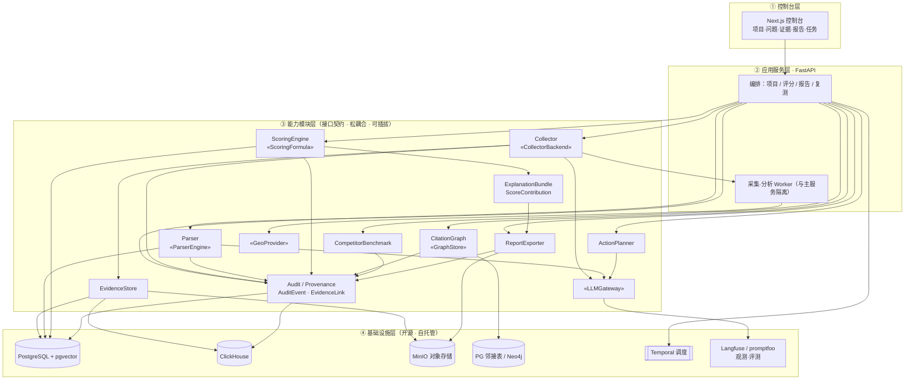
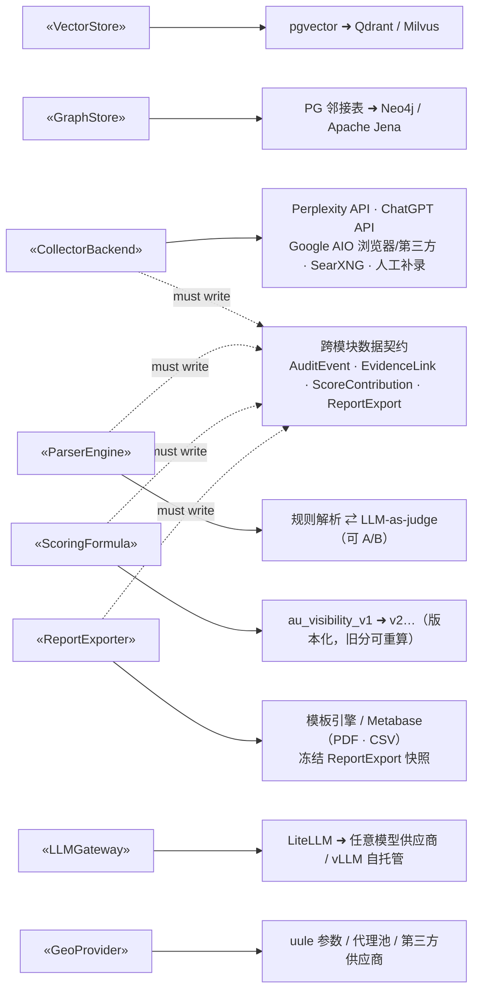
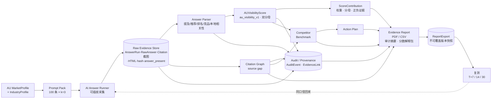

# 架构图

> **范围说明**：当前仓库本身是文档与规划项目（仓库目录结构见 [README](README.md)）。本文件画的是**规划中要构建的 GENO SaaS 澳大利亚首发系统架构**，源自规格 [docs/GENO-SaaS-AU-首发技术落地路径.md](docs/GENO-SaaS-AU-首发技术落地路径.md) 第 3 章，落地节奏见 [PROJECT-PLAN.md](PROJECT-PLAN.md)。
>
> 三张图：① 分层系统架构（静态结构）· ② 可插拔点（开源优先·可替换）· ③ 证据优先数据流水线（运行时）。Mermaid 在 GitHub / GitLab / VS Code 等可直接渲染。
>
> 📐 **出版级图注与设计规范**（配色 / 形状 / 线型 / 栏宽 / 逐图坐标，可据此产出 TikZ / SVG 矢量图）见 [docs/figure-specs.md](docs/figure-specs.md)。

## 1. 分层系统架构

三条硬约束在图中的体现：**开源优先**（基础设施全部开源自托管）、**松耦合**（上层只依赖下层接口、模块间走数据契约）、**可插拔**（带 `«接口»` 的模块其后端可替换，见图 2）。同时，P0a 开始就把 `AuditEvent`、`EvidenceLink`、`ScoreContribution`、`ReportExport` 作为跨模块数据契约，保证可审计、可溯源、可解释。

层与里程碑对应：能力模块层逐个由 [PROJECT-PLAN](PROJECT-PLAN.md) 的 M0（接口与底座）→ M5 落地；基础设施层在 M0 一键起服。

## 2. 可插拔点（开源优先 · 可替换）

左侧是先定义、后实现的**接口契约**；右侧是可替换实现。换实现时只新增一个适配器，不动业务代码（对应 PROJECT-PLAN 的「架构验收门槛」）。

## 3. 证据优先数据流水线（运行时）

平台**评分权重**（Google 45 / ChatGPT 30 / Perplexity 25）与**采集构建顺序**（Perplexity 最易先建、Google AIO 最难当 spike）是两回事；下图是数据流，不是构建序。

阶段与里程碑对应：MarketProfile/Prompt Pack → M1，Runner/Evidence/Audit 基础 → M2a，Parser/Score/ScoreContribution → M3，Citation/Benchmark → M4，ReportExport → M5，Action/复测 → M6。

## 4. 关键约束（图背后的规则）

- **依赖方向单向向下**：上层只依赖下层暴露的接口，不依赖其实现。
- **模块间走数据契约**：稳定的表结构/事件结构，不共享内部对象。
- **采集隔离**：采集 Worker 与主服务分进程，避免脆弱的浏览器自动化拖垮全局。
- **采集两大保真度问题原生处理**：API ≠ 消费者界面（抽检差异）；Google AIO 选择性触发（`answer_present` 双分母）。
- **审计/溯源/解释不可后补**：采集、解析、评分、人工补录、实体确认、报告导出必须写 `AuditEvent`；报告数值必须通过 `ReportExport -> VisibilityScoreSnapshot -> ScoreContribution -> AnswerAnalysis -> AnswerRun` 追溯；分数必须展示权重、分母、证据和局限。
- **开源优先但接口前置**：MVP 能一个组件覆盖就不引第二个（向量先 pgvector、图先 PG 邻接表），但接口按"将来要换"设计。
