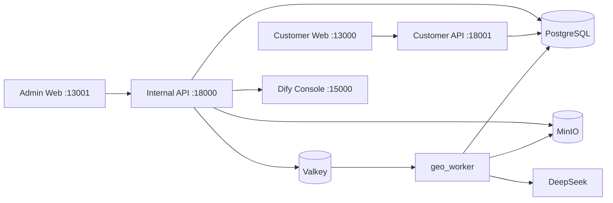

# GEO Platform

GEO Platform 是一个以证据为基础的 AI 搜索监测与渠道投放系统。它帮助团队记录消费者问题和 AI 回答，识别品牌或商品的推荐与引用缺口，为具体目标网站生成渠道适配内容，经人工审核和人工发布后验证公开 URL，并用相同口径持续复测。

系统不承诺 ChatGPT、Google 或任何平台一定推荐某个商品，也不登录第三方账号或自动发帖。第三方平台发布始终是有授权人员执行的外部动作，系统负责提供任务、文案、证据、审核、回填、验证和测量链路。

## 当前入口

单栈部署和当前 staging 验收统一使用以下宿主机端口：

| 入口 | 地址 | 边界 |
| --- | --- | --- |
| Admin Web | `http://localhost:13001` | 项目、证据、监测、目的地、生成、审核、投放管理 |
| Customer Web | `http://localhost:13000` | 客户只读指标、测量窗口、已验证 URL 和已批准报告 |
| Internal API | `http://localhost:18000` | 内部管理与写入 API |
| Customer API | `http://localhost:18001` | 独立进程中的客户最小权限只读 API |
| Dify Console | `http://localhost:15000` | 托管工作流编辑和运行 |

这些是 `infra/geo-stack.env.example` 与 canonical 单栈 Compose 的默认端口。端口冲突时可以在
`infra/geo-stack.env` 覆盖对应变量，但验收证据必须记录实际地址。`make dev-up` 仍可用于
隔离开发测试（默认 3000/3001/8000/8001），不能与 canonical 单栈同时运行，也不承载迁移目标。

## 一次启动完整开发栈

前置要求：Docker Compose、uv、Node.js 22 和 Corepack。

```bash
make install
cp -n .env.example .env
test -s deepseek_api_key.txt
chmod 600 deepseek_api_key.txt
make dev-up
```

`make dev-up` 会启动 PostgreSQL、Alembic migration、MinIO、Valkey、Internal/Customer API、`geo_worker`、Outbox Relay、Admin Web 和 Customer Web。常用命令：

```bash
make dev-logs
make dev-down
make ci
```

首次建立 ADVINSYS Australia 演示项目时，在开发栈健康后执行：

```bash
uv run python scripts/provision_advinsys_project.py
```

该命令可重复执行，不会复制项目对象。它为当前开发 owner 创建或复用项目，初始化品牌、三款产品、AU 市场、九个渠道、三条 Campaign、每条 Campaign 的九个渠道任务、六个知识来源、四条官方 Evidence 和九平台 Prompt Catalog。项目入口为脚本输出的 `project_id`；默认开发数据对应 `http://localhost:3001/projects/983fa88d-097a-4252-9ab3-fc4371799c55`。

开发 Key 只允许放在被 Git 忽略的只读文件中。不得把 DeepSeek Key 写入 `.env`、请求体、日志、截图或提交记录。

## 运行架构



- PostgreSQL 是业务对象、审计和 Durable Job 的唯一真源。
- Valkey/Dramatiq 只唤醒 Worker；消息丢失不等于任务丢失。
- Outbox Relay 将已提交的数据库事件投递给 Worker。
- MinIO 保存 Evidence、Prompt Bundle、导出包等不可变工件。
- DeepSeek 只由 Worker 调用；API 不接触模型 Key。
- Customer API 不注册内部审核、Prompt、Job、成员或工程路由。
- Admin Web 的“知识库”支持 URL、文本、TXT、Markdown、CSV、JSON、HTML、PDF 和 DOCX；来源通过接收、解析、清洗、分块、事实提取和质检六阶段 Durable Job 后才可进入 Evidence 治理。

完整业务链为：

```text
Project Catalog
-> Campaign + frozen Monitoring Protocol
-> baseline observations
-> nine governed Destinations + nine Opportunities per Campaign
-> Brief Version
-> Evidence Pack Attempt
-> Prompt Release + frozen Prompt Bundle
-> Durable Generation Job
-> Package Version + Claims
-> maker-checker Review
-> Export (optional, no publication side effect)
-> explicit Publication Request
-> manual third-party Submission
-> URL Verification Job
-> T+28 / T+56 / T+84 measurements
-> approved customer report
```

## 项目结构

```text
apps/
  api/
    geo_api/          Internal/Customer ASGI 入口、Router、HTTP contracts
    geo_worker/       Durable Job actor 与 Outbox Relay
  admin-web/          内部管理端 Next.js 应用
  customer-web/       客户只读门户 Next.js 应用
packages/
  geo_core/
    geo_core/         Domain、Application Service、Port、PostgreSQL/MinIO Adapter
  web/                双 Web 共享的 auth、API client、types 与 UI
prompt/               九渠道文件式投放 Prompt、默认输出合同与运行时边界
infra/
  db/alembic/         唯一数据库基线、版本与 checksum
  docker-compose.yml  完整开发栈
  compose.prod.yml    独立生产栈
  backup/ minio/ otel/  备份、对象存储与遥测传输配置
contracts/openapi/    稳定 API 快照及 manifest
scripts/              provisioning、OpenAPI、备份与恢复入口
tests/                architecture、unit、integration、infra、web、live
docs/                 当前架构、ADR、操作手册、工程治理和两份历史设计输入
```

依赖方向固定为 `Router -> Application Service -> Domain + Port <- Adapter`。Domain 不依赖 FastAPI、psycopg、HTTP、MinIO SDK 或环境变量；外部模型调用期间不得持有数据库事务或行锁。

## 核心不变量

- 每个选中渠道都创建持久投放任务；政策未审核或证据不足时任务保持可见并显示阻断原因。
- `owned_site`、`amazon`、`youtube`、`tiktok`、`instagram`、`productreview`、`reddit`、`ozbargain`、`quora` 是九个标准渠道。
- Dify 目录中的十条工作流只在 Dify 编辑：十条均已完成冻结发布图登记、真实 DeepSeek Canary 和 staging 激活；`style_profile` 与 `recommendation` 的真实业务 Job 仍必须分别使用已批准样本和真实证据验收。Recommendation 的可选 Arbiter 仍由 GEO 原生执行。
- `style_judge`、`arbiter`、`metric_judge`、`offline_answer` 四类继续由 GEO Prompt Program 和原生运行时执行；[`prompt/`](prompt/README.md) 只保留九渠道文件式投放 Prompt，不得覆盖 Dify 托管的十条工作流。`reference_translation` 仍为不可执行的预留类型。
- Evidence Pack 重试创建新 Attempt，旧 Attempt 永不原地重建。
- Package Version 不可变；人工编辑创建新版本并重新执行 Claim QA 和审核。
- `submitted_for_review_by` 与 `reviewer_id` 必须不同，批准分数不得低于 85。
- Export、Publication Request、Submission、Verification 是四个不同事件；Export 不创建待发布记录。
- 公开 URL 验证成功后才计入已验证覆盖，并进入 T+28/T+56/T+84 测量。
- 项目内关系同时使用复合外键和 RLS；RLS 不能替代关系完整性。

## 下一阶段发展目标

以下能力已明确列为当前效果优先原型之后的必做目标，不因本阶段采用人工流程而取消：

1. **完整连接器平台（F-006）**：建立统一的连接定义、项目级授权、secret reference、同步游标、限流重试、原始工件、schema/version、freshness 和运行状态；优先交付 GSC、GA4 与官方 Google/Bing AI 报告文件导入，再按价值扩展 Bing Webmaster、Clarity、CRM、CMS 和 warehouse。
2. **完整跨引擎观测平台（F-009）**：建设 Sampling Suite/Run/Task、官方 API adapter、官方报告导入、受控人工 UI 抽样、运行进度和不可变原始工件；严格区分 official report、manual UI、provider API、proxy grounded API、automated browser capture 和 synthetic。对没有公开合规 API 的 Google AI Overviews/AI Mode、Bing Copilot 等消费者 Surface，在逐 Surface 授权通过后使用澳洲 sticky egress、同一代理租约的 pre/target/post 地域证明和受控 Browser Capture Connector；未通过授权的 Surface 只允许合规人工导入，且绝不与自动采样合并分母。
3. **完整实验统计与告警平台（F-021）**：实现自动重复采样、按 engine/model/source/locale/region/query cluster 分层、区间、胜平负、最差结果、跨查询负收益、模型/来源漂移、阈值与基线告警及处置记录；样本不足不得形成稳定结论，不同来源不得合并分母。
4. **业务结果与 AI referral 归因（F-007）**：串联 AI referrer/UTM、landing page、session、conversion/key event、qualified lead、CRM stage 和 revenue，并回溯到 Campaign、问题、内容、engine/source mode 与版本；明确 last-click、assisted attribution、零点击影响和非因果边界。
5. **可解释建议与不修改机制（F-020）**：用问题、证据等级、影响链、页面/问题簇、风险、工作量、业务价值、置信度和验证计划形成可回溯建议；支持 blocker、gap、experiment、optional、`no_change` 和 `insufficient_evidence`，并保留人工审批。
6. **Dify 工作流与知识生成运行层（F-022）**：自托管 Dify `1.16.0` 的目录现包含十个 GEO Workflow，十条均已进入相同的 fail-closed 路由、冻结发布图、结构化结果持久化/重放、只读 Admin 展示，并在 fresh staging 完成真实 DeepSeek Canary 与激活。`style_profile` 和 `recommendation` 的技术迁移完成不替代真实 Profile build/Recommendation 业务 Job 验收。Recommendation 的可选 Arbiter，以及 `style_judge`、`metric_judge`、`offline_answer`，继续作为 GEO 内置评审，不迁移到 Dify。Dify Test Run 仍只注入五个后台 `geo_*` 字段，GEO 继续保留 Fact、Evidence、Job 和业务结果。部署、激活与恢复见 [Dify 运行手册](infra/dify/README.md)。

具体范围、调研结论和验收边界见 [GEO 效果优先整改决策记录](docs/audits/GEO-effect-first-remediation-decisions-2026-07-18.md)。

## 文档与质量门禁

- [文档索引](docs/README.md)
- [本轮 14 项 ACCEPTED 整改验证记录](docs/engineering/GEO-accepted-remediation-verification-record-2026-07-19.md)
- [整改门禁与外部 staging 边界](docs/operations/remediation-gates.md)
- [单栈部署与跨服务器迁移](docs/operations/geo-deploy-and-migration.md)
- [当前系统架构](docs/architecture/system-overview.md)
- [GEO v3 运行与验收合同](docs/GEO-v3-%E5%85%A8%E6%B5%81%E7%A8%8B%E8%BF%90%E8%A1%8C%E6%89%8B%E5%86%8C.md)
- [ADVINSYS GEO 独立全流程操作手册](docs/operations/geo-ui-operator-guide.md)（[PDF](docs/operations/ADVINSYS-GEO-%E5%85%A8%E6%B5%81%E7%A8%8B%E9%83%A8%E7%BD%B2%E8%BF%90%E7%BB%B4%E6%89%8B%E5%86%8C.pdf)）
- [生产部署](docs/operations/production-runbook.md)
- [备份与恢复](docs/operations/backup-restore.md)

```bash
make quality
make test-migrated
make test-integration
make openapi-contracts
make web-build
```

实时 DeepSeek 测试会产生外部调用费用，必须显式执行 `make deepseek-live`，并保留 Prompt Bundle hash、Evidence Pack hash、模型调用日志、Package hash 和审核记录。历史设计和旧阶段证据只用于追溯，不是当前可用性证明。
