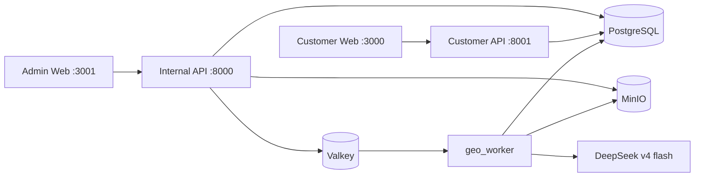

# GEO Platform

GEO Platform 是一个以证据为基础的 AI 搜索监测与渠道投放系统。它帮助团队记录消费者问题和 AI 回答，识别品牌或商品的推荐与引用缺口，为具体目标网站生成渠道适配内容，经人工审核和人工发布后验证公开 URL，并用相同口径持续复测。

系统不承诺 ChatGPT、Google 或任何平台一定推荐某个商品，也不登录第三方账号或自动发帖。第三方平台发布始终是有授权人员执行的外部动作，系统负责提供任务、文案、证据、审核、回填、验证和测量链路。

## 当前入口

本地验收统一使用以下宿主机端口：

| 入口 | 地址 | 边界 |
| --- | --- | --- |
| Admin Web | `http://localhost:3001` | 项目、证据、监测、目的地、生成、审核、投放管理 |
| Customer Web | `http://localhost:3000` | 客户只读指标、测量窗口、已验证 URL 和已批准报告 |
| Internal API | `http://localhost:8000` | 内部管理与写入 API |
| Customer API | `http://localhost:8001` | 独立进程中的客户最小权限只读 API |

这些是 `.env.example` 与开发 Compose 的默认宿主机端口。端口冲突时可以在根目录 `.env` 覆盖 `GEO_INTERNAL_API_HOST_PORT`、`GEO_CUSTOMER_API_HOST_PORT`、`GEO_ADMIN_WEB_HOST_PORT` 和 `GEO_CUSTOMER_WEB_HOST_PORT`，但验收证据必须记录实际地址。

## 一次启动完整开发栈

前置要求：Docker Compose、uv、Node.js 22 和 Corepack。

```bash
make install
cp -n .env.example .env
test -s deepseek_api_key.txt
chmod 600 deepseek_api_key.txt
make dev-up
```

`make dev-up` 会启动 PostgreSQL、Alembic migration、MinIO、Valkey、Internal/Customer API、`geo_worker`、Outbox Relay、Admin Web 和 Customer Web。常用命令：

```bash
make dev-logs
make dev-down
make ci
```

开发 Key 只允许放在被 Git 忽略的只读文件中。不得把 DeepSeek Key 写入 `.env`、请求体、日志、截图或提交记录。

## 运行架构



- PostgreSQL 是业务对象、审计和 Durable Job 的唯一真源。
- Valkey/Dramatiq 只唤醒 Worker；消息丢失不等于任务丢失。
- Outbox Relay 将已提交的数据库事件投递给 Worker。
- MinIO 保存 Evidence、Prompt Bundle、导出包等不可变工件。
- DeepSeek 只由 Worker 调用；API 不接触模型 Key。
- Customer API 不注册内部审核、Prompt、Job、成员或工程路由。

完整业务链为：

```text
Project Catalog
-> Campaign + frozen Monitoring Protocol
-> baseline observations
-> nine governed Destinations + nine Opportunities
-> Brief Version
-> Evidence Pack Attempt
-> Prompt Release + frozen Prompt Bundle
-> Durable Generation Job
-> Package Version + Claims
-> maker-checker Review
-> Export (optional, no publication side effect)
-> explicit Publication Request
-> manual third-party Submission
-> URL Verification Job
-> T+28 / T+56 / T+84 measurements
-> approved customer report
```

## 项目结构

```text
apps/
  api/
    geo_api/          Internal/Customer ASGI 入口、Router、HTTP contracts
    geo_worker/       Durable Job actor 与 Outbox Relay
  admin-web/          内部管理端 Next.js 应用
  customer-web/       客户只读门户 Next.js 应用
packages/
  geo_core/
    geo_core/         Domain、Application Service、Port、PostgreSQL/MinIO Adapter
  web/                双 Web 共享的 auth、API client、types 与 UI
infra/
  db/alembic/         唯一数据库基线、版本与 checksum
  docker-compose.yml  完整开发栈
  compose.prod.yml    独立生产栈
  backup/ minio/ otel/ prometheus/
contracts/openapi/    稳定 API 快照及 manifest
scripts/              provisioning、OpenAPI、备份与恢复入口
tests/                architecture、unit、integration、infra、web、live
docs/                 当前架构、ADR、操作手册、工程治理和历史归档
```

依赖方向固定为 `Router -> Application Service -> Domain + Port <- Adapter`。Domain 不依赖 FastAPI、psycopg、HTTP、MinIO SDK 或环境变量；外部模型调用期间不得持有数据库事务或行锁。

## 核心不变量

- 每个选中渠道都创建持久投放任务；政策未审核或证据不足时任务保持可见并显示阻断原因。
- `owned_site`、`amazon`、`youtube`、`tiktok`、`instagram`、`productreview`、`reddit`、`ozbargain`、`quora` 是九个标准渠道。
- Prompt/Skill 可独立编辑和发布；每次生成冻结 Prompt Bundle，不把提示词硬编码进工作流。
- Evidence Pack 重试创建新 Attempt，旧 Attempt 永不原地重建。
- Package Version 不可变；人工编辑创建新版本并重新执行 Claim QA 和审核。
- `submitted_for_review_by` 与 `reviewer_id` 必须不同，批准分数不得低于 85。
- Export、Publication Request、Submission、Verification 是四个不同事件；Export 不创建待发布记录。
- 公开 URL 验证成功后才计入已验证覆盖，并进入 T+28/T+56/T+84 测量。
- 项目内关系同时使用复合外键和 RLS；RLS 不能替代关系完整性。

## 文档与质量门禁

- [文档索引](docs/README.md)
- [当前系统架构](docs/architecture/system-overview.md)
- [GEO v3 运行与验收合同](docs/GEO-v3-%E5%85%A8%E6%B5%81%E7%A8%8B%E8%BF%90%E8%A1%8C%E6%89%8B%E5%86%8C.md)
- [逐步全流程操作手册](docs/operations/geo-full-flow-runbook.md)
- [生产部署](docs/operations/production-runbook.md)
- [备份与恢复](docs/operations/backup-restore.md)

```bash
make quality
make test-migrated
make test-integration
make openapi-contracts
make web-build
```

实时 DeepSeek 测试会产生外部调用费用，必须显式执行 `make deepseek-live`，并保留 Prompt Bundle hash、Evidence Pack hash、模型调用日志、Package hash 和审核记录。历史设计、阶段报告和 `runtime_preflight` 旧证据只用于追溯，不是当前可用性证明。
