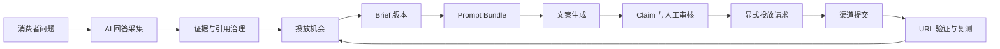

# 系统总览

## 产品目标

系统面向通用 GEO 场景：采集 AI 搜索对消费者问题的回答和引用，识别品牌与商品的推荐缺口，选择 AI 经常参考且允许投放的目标网站，为各渠道生成证据可追踪的文案，人工审核后执行投放，并持续验证公开页面与 AI 推荐结果变化。

## 部署单元

系统采用模块化单体，不拆微服务。相同代码库生成四个用户可见部署单元：Internal API、Customer API、Admin Web 和 Customer Web。Worker 是异步执行入口，与 API 共用 Application Service 和 Domain。

Internal API 与 Customer API 有独立 ASGI 入口和 OpenAPI。Customer API 只注册客户 DTO 和只读投影；内部路由在 Customer 进程中不存在。PostgreSQL 保存全部业务状态和任务状态，MinIO 保存不可变工件，Valkey/Dramatiq 只负责通知 Worker 有任务可领取。

## 业务主链

`Campaign → Monitoring Query → Evidence → Destination → Opportunity → Brief Version → Evidence Pack Attempt → Prompt Bundle → Generation Job → Placement Package Version → Review → Publication Request → Submission → Verification → Measurement`

每个目标渠道都有独立投放任务。导出内容不表示准备发布，不得自动产生 Publication Request。已发布版本发生事实失效时，新建版本并重新执行 Claim、QA 和审核，历史发布 lineage 保留。
