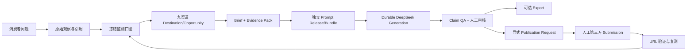

# 系统总览

## 产品目标

系统面向通用 GEO 场景：记录 AI 搜索对消费者问题的回答和引用，识别品牌与商品的推荐缺口，为具体且允许品牌参与的网站建立投放任务，生成证据可追踪的渠道内容，经人工审核和人工发布后验证公开页面，并用冻结口径持续复测。



## 部署单元

系统是模块化单体，不拆业务微服务。相同代码库构建六个运行进程：

| 进程 | 开发入口 | 职责 |
| --- | --- | --- |
| Admin Web | `localhost:3001` | 内部管理和投放工作区 |
| Customer Web | `localhost:3000` | 客户只读门户 |
| Internal API | `localhost:8000` | 内部稳定读写 surface |
| Customer API | `localhost:8001` | 独立最小权限只读 surface |
| Task Worker | 无公网入口 | Durable Job 执行、DeepSeek 和外部验证 |
| Outbox Relay | 无公网入口 | 提交后事件到 Valkey/Dramatiq 的可靠唤醒 |

基础设施职责：

- PostgreSQL：业务对象、RLS、审计、Job、lease、fencing、idempotency 和 outbox 真源；
- MinIO：Evidence、Prompt Bundle、模型/导出 manifest 等不可变工件；
- Valkey/Dramatiq：只做低延迟唤醒，不能成为业务状态真源；
- DeepSeek：仅由 Task Worker 通过只读 Secret 调用；
- OTel/Prometheus：运行元数据观测，不采集正文、Prompt、Token 或 Cookie。

Customer API 有独立 ASGI 入口和 OpenAPI，只注册 Customer DTO 与已批准/已验证投影。内部路由在 Customer 进程中不存在，不使用 403 假装隔离。

## 业务主链

```text
Project
-> Entity + Market Profile + Evidence Item
-> Campaign
-> Monitoring Protocol + Query + Observation + Metric + Report
-> Publication Destination + immutable Policy Review
-> Opportunity
-> Brief Version
-> Evidence Pack Attempt
-> Prompt Skill + Template Release + Task Binding + Prompt Bundle
-> Generation Job
-> Placement Package Version + Claim
-> Review Submission + Review
-> Export (optional, no publication side effect)
-> Publication Request
-> manual Publication Submission
-> Verification Job
-> T+28 / T+56 / T+84 Measurement
```

每个 Campaign 选中的渠道都有独立 Opportunity。政策、身份或证据不足时任务保持可见并阻断。Export 不产生 Publication Request；只有显式发布意图后才进入 Submission。

## 仓库结构

```text
apps/api/geo_api/       ASGI app factory、稳定 Router、HTTP contracts/composition
apps/api/geo_worker/    Dramatiq actor 与 PostgreSQL Outbox Relay
apps/admin-web/         Admin Next.js 应用
apps/customer-web/      Customer Next.js 应用
packages/geo_core/      Domain、Application Service、Port 和 Adapter
packages/web/           双 Web 共享 auth、transport、types 和 UI
infra/db/alembic/       唯一 schema 基线、migration 和 checksum
infra/docker-compose.yml
                         完整开发栈
infra/compose.prod.yml  独立生产栈
contracts/openapi/      双 API 合同快照和 manifest
scripts/                provisioning、OpenAPI、备份和恢复命令
tests/                  architecture/unit/integration/infra/web/live
docs/                   当前架构、ADR、手册、治理与历史归档
```

公共入口文件：

- Internal ASGI：`apps/api/geo_api/internal_app.py`
- Customer ASGI：`apps/api/geo_api/customer_app.py`
- Worker actors：`apps/api/geo_worker/tasks.py`
- Outbox Relay：`apps/api/geo_worker/relay.py`
- Admin 首页：`apps/admin-web/app/page.tsx`
- Customer 首页：`apps/customer-web/app/page.tsx`
- Alembic：`alembic.ini` 与 `infra/db/alembic/`
- 开发部署：`infra/docker-compose.yml`
- 生产部署：`infra/compose.prod.yml`

历史单文件 API、旧 Worker、旧 schema 和阶段脚本不属于当前入口。它们即使仍存在于历史 commit 或 `archive/`，也不能被新代码引用。
