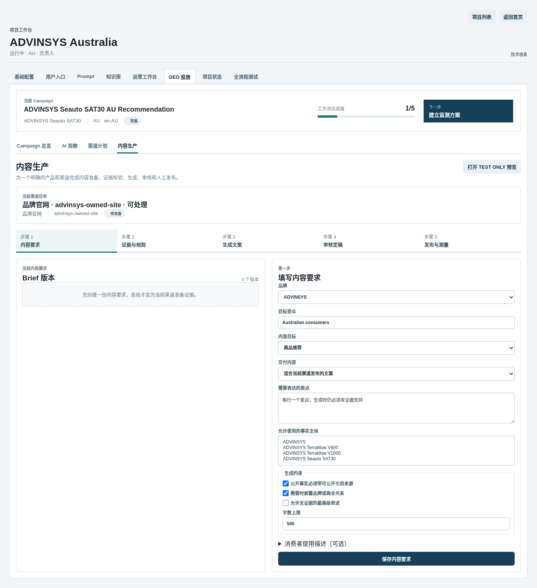
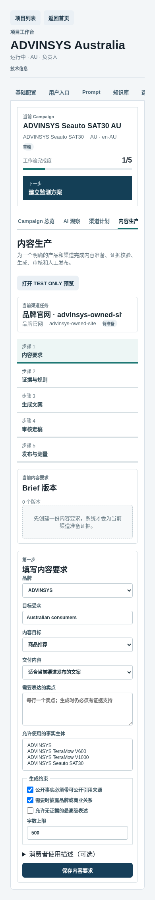

# Admin GEO 工作区可用性整改与功能保留基线

> 状态：已实施，作为后续前端回归基线
>
> 适用范围：Admin Web 项目详情页的 `GEO 投放` 工作区

## 一、整改目标

本次整改不改变 GEO 领域对象、状态机、权限、API 或持久任务语义，只重组操作界面。目标是让运营人员先看到业务名称、当前状态和下一步，在需要排障时再展开 UUID、hash、对象存储 URI 和 Job 事件。

界面遵循以下规则：

- 常规路径不要求手填 UUID、hash 或 JSON；
- 品牌、商品、市场、Campaign、渠道和版本使用可读名称选择；
- 创建、复核和高风险状态转换放入明确命名的操作面板；
- Prompt schema、模型参数、Job 事件和内部标识保留在“高级”或“技术信息”中；
- 页面顶部始终显示当前 Campaign、商品、市场、完成度和下一步；
- 手机端允许导航条横向滚动，但页面主体不得横向溢出。

## 二、信息架构

项目页保留原有项目级导航。`GEO 投放` 内收敛为四个一级入口：

| 入口 | 主要任务 | 原有能力 |
| --- | --- | --- |
| Campaign 总览 | Campaign、监测 Query、Protocol、指标和报告 | 全部保留 |
| AI 观察 | 基线/复测样本、引用、混杂因素 | 全部保留 |
| 渠道计划 | 九渠道 Destination、政策复核、Opportunity 状态 | 全部保留 |
| 内容生产 | Brief → Evidence → 生成 → 审核 → 发布与测量 | 全部保留 |

内容生产使用五步导航：

```text
1 内容要求
-> 2 证据与规则
-> 3 生成文案
-> 4 审核定稿
-> 5 发布与测量
```

`TEST ONLY Prompt Simulation` 是独立测试入口，不进入正式发布链。

## 三、功能保留矩阵

以下 36 个既有命令必须在每次前端改造后继续由真实 Server Action 提交，不能用静态按钮或演示数据替代：

| 工作区 | 必须保留的命令 |
| --- | --- |
| Campaign | `createCampaign`、`createMonitoringQuery`、`createSuggestion`、`approveSuggestion`、`createProtocol`、`changeProtocol`、`computeMetrics`、`createReport`、`approveReport` |
| 观察 | `importObservation` |
| 渠道 | `createDestination`、`reviewDestination`、`transitionOpportunity` |
| Brief/Evidence/Prompt | `createBrief`、`buildEvidence`、`installDefaultPromptCatalog`、`createPromptSkill`、`createPromptRelease`、`bindPromptTask`、`createPromptBundle` |
| 生成/审核 | `createGenerationJob`、`controlJob`、`editPackage`、`submitPackageReview`、`reviewPackage`、`createExport` |
| 发布/验证/测量 | `createPublication`、`transitionPublication`、`createSubmission`、`setSubmissionUrl`、`verifySubmission`、`blockSubmission`、`createMeasurement`、`completeMeasurementCollectionTask`、`cancelMeasurementCollectionTask` |
| 内部模拟 | `createPromptSimulation` |

自动化合同位于 `tests/test_admin_geo_workspace_contracts.py`。新增或移除命令时必须先修改领域/API 合同，再显式更新此矩阵和测试，不能只在前端静默删除。

## 四、输入整改

| 原问题 | 当前交互 | 技术兼容 |
| --- | --- | --- |
| Market/Product/Opportunity UUID 输入 | 名称下拉框 | 请求仍发送稳定 ID |
| Brief goals/constraints JSON | 受众、目标、交付物、卖点、复选框和数字输入 | Server Action 仍兼容旧 JSON 字段 |
| Policy JSON | 状态、域名、身份、自动化、披露复选项 | Server Action 组装原有结构 |
| Package content/claims JSON | 正文编辑器和逐 Claim 编辑器 | 提交前序列化为原有 API 合同 |
| Measurement metrics JSON | 标准指标复选框 | 高级调用仍可传原结构 |
| Prompt 变量 | 正式流程使用系统冻结变量 | 自定义 Prompt schema 保留在高级管理 |

UUID、content hash、pack hash、bundle hash、storage URI、provider request ID 和 Job event payload 仍可在“技术信息”中查看，便于支持、审计和故障排查。

## 五、视觉和响应式基线

- 工作型界面使用白色/中性灰和有限的青绿色状态强调，不使用营销式大 Hero；
- 表格用于跨渠道和跨版本比较，表单使用清晰字段分组；
- 每行多个状态命令折叠在“操作”中，避免屏幕同时出现大量按钮；
- 固定五步导航在桌面单行展示，在平板两列、手机单列；
- 业务名称可以换行，内部 ID 不参与普通布局；
- 桌面和手机都必须满足：无客户端异常、无 console error、无页面级横向溢出。

## 六、验收门禁

每次发布至少执行：

```bash
corepack pnpm --filter geo-production-admin-web typecheck
corepack pnpm --filter geo-production-admin-web build
uv run pytest tests/test_admin_geo_workspace_contracts.py
```

随后使用运行中的 Admin Web 检查 Campaign 总览、AI 观察、渠道计划、五个内容步骤和 TEST ONLY 页面。必须覆盖 1440px 桌面和 390px 手机视口，并验证旧 `placement_stage=intake` 深链仍落到“内容要求”。

## 七、当前界面证据

渠道计划将九个任务集中比较，状态动作默认折叠，避免页面同时出现大量按钮：


内容生产用五步导航表达顺序，常规 Brief 使用结构化字段，不要求 UUID 或 JSON：



390px 手机视口下，五步导航改为纵向布局，页面主体无横向溢出：


