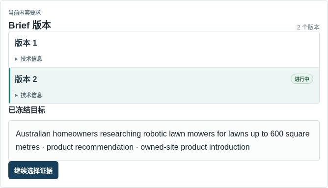
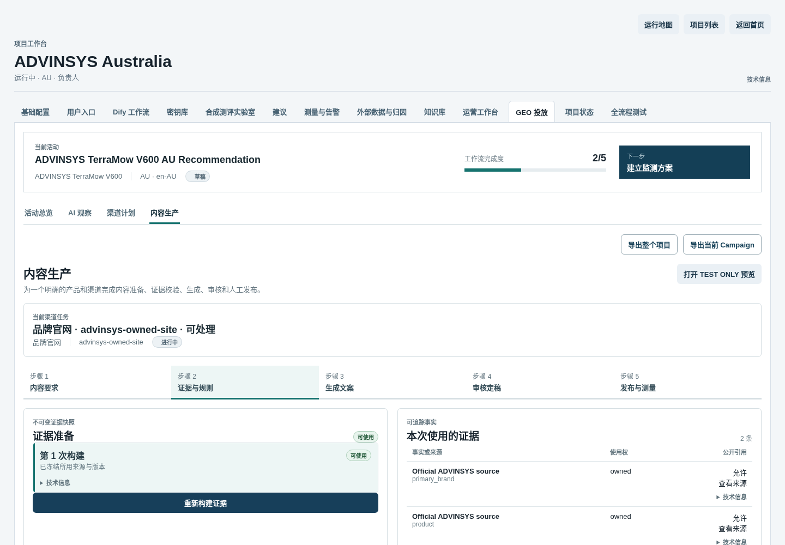
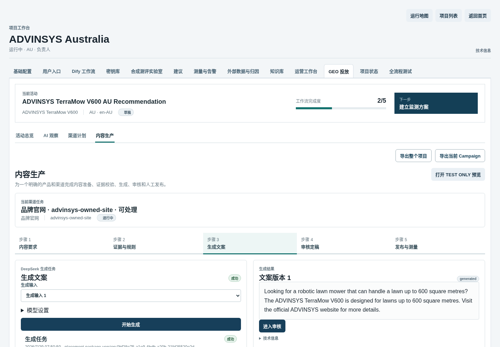
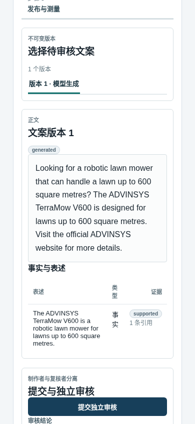

# GEO 正式业务文案生成操作手册

最后复核：2026-07-31
适用入口：GEO Admin
默认本地地址：`http://127.0.0.1:13001`
适用角色：内容运营人员、独立审核人员

本文件独立说明如何从渠道任务、Brief 和治理合格证据生成可进入正式审核链路的业务文案。“生成成功”不等于“审核通过”，更不等于“已经发布”。

## 1. 完成结果

完整操作会依次产生：

1. 不可变 Brief Version；
2. Evidence Pack Attempt；
3. 冻结的生成输入 Bundle；
4. Durable Generation Job；
5. 不可变 Package Version、正文和 Claim 清单；
6. 后续人工审核结论。

本手册止于生成与审核入口。第三方发布必须在“发布与测量”中另行显式执行。

## 2. 操作前检查

开始前确认：

- 已选择目标项目、活动和渠道任务；
- 渠道任务不是未解释的阻断状态；
- 项目中存在正确品牌、产品和市场；
- 知识与 Evidence 已覆盖准备表达的产品事实；
- 当前渠道任务绑定了可用的 Prompt Release；
- Dify 工作流、DeepSeek、Task Worker、PostgreSQL 和 MinIO 可用。

## 3. 进入内容生产

1. 打开 Admin 项目列表并进入目标项目。
2. 点击 `GEO 投放`。
3. 在“当前活动”选择目标活动。
4. 点击 `内容生产`。
5. 在“当前渠道任务”选择要生成文案的渠道。

页面会显示五个步骤：内容要求、证据与规则、生成文案、审核定稿、发布与测量。

## 4. 步骤 1：保存内容要求

1. 打开 `内容要求`。
2. 选择主品牌和正确产品主体。
3. 填写目标受众、内容目标和交付内容。
4. 填写需要表达的卖点；每个卖点仍需 Evidence 支持。
5. 选择允许使用的事实主体；只有明确比较任务才选择竞品。
6. 设置公开引用、商业披露、最高级表述和字数限制。
7. 只有掌握已授权的真实消费者描述时才填写“消费者使用描述”。
8. 点击 `保存内容要求`。

成功后页面显示 Brief 版本和内容哈希。修改目标时点击“保存新版本”，不要覆盖旧版本。

下图只截取真实 Brief 面板，避免把右侧“创建修订版本”的默认表单误认为当前冻结输入：

## 5. 步骤 2：构建证据并冻结输入

### 5.1 构建 Evidence Pack

1. 点击 `继续选择证据` 或打开 `证据与规则`。
2. 点击 `构建证据`。
3. 等待 Evidence Pack Attempt 到达终态。
4. 检查每条 Evidence 的事实主体、使用权和公开引用资格。

终态处理：

- `ready`：可以继续；
- `needs_evidence`：补充或批准正确事实，再重新构建；
- `blocked`：先解决授权、保密、主体冲突或渠道政策问题；
- `failed`：阅读任务错误，修复依赖后创建新 Attempt。

### 5.2 冻结生成输入

1. 确认页面显示当前渠道 Prompt 绑定、Release ID、版本和哈希。
2. 选择状态为 `ready` 的证据版本。
3. 勾选“确认使用以上 Prompt Release ID、版本与 hash”。
4. 点击 `确认并冻结生成输入`。
5. 选择新生成的 Bundle，并点击 `继续生成文案`。

日常内容操作不需要修改“高级：Prompt 规则与版本管理”。若缺少绑定，应由管理员修复 Dify Release/绑定后再继续。

下图显示真实 Evidence Pack 为可用状态，并列出本次两条可追踪 Evidence：

## 6. 步骤 3：生成文案

1. 确认页面已经选中最新且非“迁移历史”的生成输入。
2. 展开“模型设置”时，通常保留默认模型和总调用预算。
3. 点击 `开始生成`。
4. 观察任务状态：排队、运行、成功或失败。
5. 成功后检查右侧是否出现“文案版本”。
6. 阅读正文，并展开技术信息确认 Package Version ID 和内容哈希。

下图中的 Job 和文案版本都来自真实 Dify/DeepSeek 运行，不是 fixture：

## 7. 检查生成结果

生成成功后至少检查：

- 正文符合 Brief 的受众、意图、渠道和字数；
- 产品型号和主体没有串用；
- 事实句已进入 Claim 清单；
- 每条事实 Claim 有正确 Evidence；
- 没有无证据最高级、虚构体验或错误竞品结论；
- 实际模型、完成原因和输出哈希可追踪。

点击 `进入审核` 后，正文才进入人工审核工作区。

## 8. 步骤 4：提交人工审核

1. 选择待审核文案版本。
2. 逐句核对正文与 Claim 清单。
3. 内容运营人员点击 `提交独立审核`。
4. 独立审核人员确认 Claim 清单完整、每条事实有证据，并填写评分与说明。
5. 选择批准、要求修改、拒绝或阻断。
6. 点击 `保存审核结论`。

需要修改时，使用“人工修改并创建新版本”。不要直接改写已生成版本。创建不可变导出不会自动创建发布任务。

移动审核页会同时显示正文、事实 Claim、支持状态和 Evidence 数量：

## 9. 已验证的 ADVINSYS V600 案例

### 9.1 真实对象链

| 对象 | 值 / 状态 |
| --- | --- |
| Project | `6f93ee7b-bd7f-4fca-92b2-0de17254953a` |
| Campaign | `049efe96-2ef6-4020-885f-df770ce5ab90` |
| Owned Site Opportunity | `85285108-ed3a-4a48-be0e-7d4a31f9024a` · `in_progress` |
| Destination | `advinsys-owned-site` · policy `approved` |
| Brief Version | `72ac2f5c-945c-4b06-aadc-a23b02e4dfcb` · v2 |
| Evidence Pack Attempt | `bebbc65f-9532-5c9e-9e1e-7b9fdc9a3198` · `ready` |
| Bundle | `3d22ce37-595a-4f1c-8bc6-14b11e00e195` |
| Generation Job | `b4c9f976-077f-40e2-99e9-fe7b75bcca54` · `succeeded` |
| Dify Run | `aa27fd16-1faf-46fa-8bc5-364e4180cba9` |
| Package Version | `0bf28e75-a1e9-4bdb-a20b-21fd25520e2d` · `generated` |

生成结果页：

<http://127.0.0.1:13001/projects/6f93ee7b-bd7f-4fca-92b2-0de17254953a?tab=geo&geo_section=placement&placement_stage=generation&campaign_id=049efe96-2ef6-4020-885f-df770ce5ab90&opportunity_id=85285108-ed3a-4a48-be0e-7d4a31f9024a&brief_version_id=72ac2f5c-945c-4b06-aadc-a23b02e4dfcb&attempt_id=bebbc65f-9532-5c9e-9e1e-7b9fdc9a3198&bundle_id=3d22ce37-595a-4f1c-8bc6-14b11e00e195&job_id=b4c9f976-077f-40e2-99e9-fe7b75bcca54&version_id=0bf28e75-a1e9-4bdb-a20b-21fd25520e2d>

审核页：

<http://127.0.0.1:13001/projects/6f93ee7b-bd7f-4fca-92b2-0de17254953a?tab=geo&geo_section=placement&placement_stage=review&campaign_id=049efe96-2ef6-4020-885f-df770ce5ab90&opportunity_id=85285108-ed3a-4a48-be0e-7d4a31f9024a&version_id=0bf28e75-a1e9-4bdb-a20b-21fd25520e2d>

### 9.2 冻结 Brief

| 字段 | 实际值 |
| --- | --- |
| 受众 | `Australian homeowners researching robotic lawn mowers for lawns up to 600 square metres` |
| 目标 | `product recommendation` |
| 交付内容 | `owned-site product introduction` |
| 卖点 | 解释经证据确认的草坪面积适配；引导访问 ADVINSYS 官方产品页 |
| 字数上限 | `220` |
| 公开引用 / 商业披露 | `true` / `true` |
| 无证据最高级 | `true` |

这条历史冻结输入允许 `unsupported_superlatives=true`，但本次输出没有使用最高级。新的正式运行建议设为 `false`，除非存在明确业务理由和相应审核规则。

### 9.3 实际正文与 Claim

> Looking for a robotic lawn mower that can handle a lawn up to 600 square metres? The ADVINSYS TerraMow V600 is designed for lawns up to 600 square metres. Visit the official ADVINSYS website for more details.

系统抽取了一条事实 Claim：

| Claim | 类型 | 支持状态 | Evidence |
| --- | --- | --- | --- |
| `The ADVINSYS TerraMow V600 is a robotic lawn mower for lawns up to 600 square metres.` | `factual` | `supported` | `54f8d74f-4751-48cc-9de0-3f3bae5b280b` |

当前没有 Review Submission，也没有 Review 决定。真实完成状态是“文案已生成，等待内容运营人员提交独立审核”，不是“正式可发布”。

## 10. 成功判定

生成环节同时满足以下条件才算完成：

- Bundle 来自当前 Brief、ready Evidence Pack 和当前 Prompt 绑定；
- Job 为成功终态；
- 页面生成了不可变 Package Version，而不是只显示模型成功日志；
- 正文、Claim、Evidence、输入/输出哈希和实际模型可查看；
- 文案仍停在正常审核状态，没有被自动批准或发布。

若目标是“正式可发布”，还必须由独立审核人员批准；发布仍需用户在步骤 5 明确操作。

## 11. 常见问题与恢复

| 现象 | 原因 | 处理 |
| --- | --- | --- |
| 页面提示“还没有冻结的生成输入” | 尚未完成 Evidence Pack 和 Bundle | 返回“证据与规则”，构建证据并冻结输入 |
| Bundle 标记“迁移历史（只读）” | 旧 Bundle 没有当前 Prompt Release 绑定 | 返回证据步骤，用当前绑定重新冻结 Bundle |
| 无法冻结输入 | Brief、ready Attempt 或 Prompt 绑定缺失 | 按页面提示补齐对应对象 |
| Job 临时失败或模型 503/限流 | 外部模型短暂不可用 | 保持原输入不变时点击 `重试` |
| 需要一条新的执行审计链 | 需要重新调用但保留旧执行 | 点击 `重新执行` |
| Brief、Evidence 或 Prompt 已改变 | 原 Bundle 已不代表当前输入 | 创建新版本、新 Attempt 和新 Bundle，不重试旧 Job |
| Job 长期运行 | Worker、Outbox、lease 或模型调用异常 | 查看“高级：生成任务事件”；恢复依赖后再重试，避免连续点击 |
| 正文有无证据 Claim | 输入证据不足或模型结果不合格 | 不批准；补证据或修订输入后生成新版本 |

同一外部错误连续出现三次时停止盲目重试，保存 Job ID、Bundle ID、输入哈希、错误码和发生时间后排查。

## 12. 操作检查清单

- [ ] 已选择正确活动和渠道任务。
- [ ] Brief 的品牌、产品、受众和目标正确。
- [ ] Evidence Pack 为 ready，主体和使用权正确。
- [ ] 已确认当前 Prompt Release 并冻结 Bundle。
- [ ] Generation Job 成功并物化 Package Version。
- [ ] 正文和 Claim 已逐条检查。
- [ ] 已进入独立审核，没有把生成成功当作发布完成。
