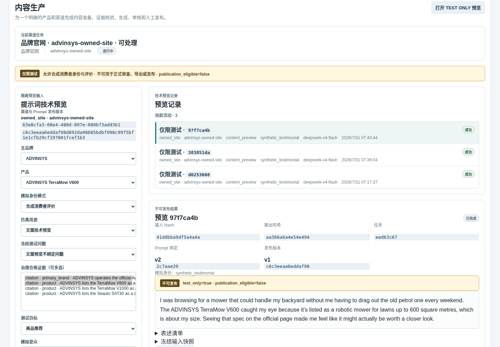
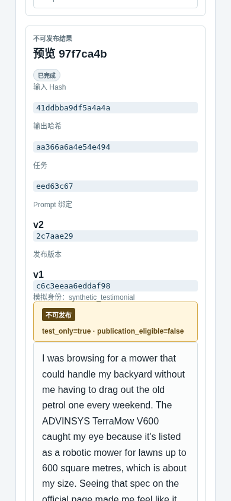

# GEO 仿真消费者文案操作手册

最后复核：2026-07-31
适用入口：GEO Admin
默认本地地址：`http://127.0.0.1:13001`
适用角色：内容运营人员、内部测试人员

本文件独立说明如何从 Admin 生成一条澳洲英文仿真消费者短评。该功能只用于内部技术预览，结果始终为 `test_only=true`、`publication_eligible=false`，不得冒充真实消费者评价或进入正式发布链。

这条流程不是“合成测评实验室”的九渠道高拟真语料实验。后者还需要合法风格样本、风格画像、Review Suite 和离线实验。

## 1. 完成结果

一次成功操作会产生：

1. 冻结的仿真输入快照；
2. 一条 Durable `prompt_simulation.generate` Job；
3. Dify `placements.simulation` 的真实模型调用；
4. 通过应用质量门禁的消费者风格正文和 Claim 清单；
5. 不可变 TEST ONLY 结果及输入、输出和模型 lineage。

## 2. 操作前检查

开始前确认：

- 已选择正确项目、活动和渠道任务；
- 渠道任务绑定了可用 Prompt Release；
- 项目中存在正确品牌和产品；
- 至少有一条治理合格 Evidence；
- Dify、DeepSeek 和 Task Worker 可用。

如果页面显示“当前渠道任务缺少可用 Prompt 绑定、品牌、产品或证据”，必须先补齐对应对象，不能通过手填 ID 绕过。

## 3. 进入 TEST ONLY 预览

1. 打开 Admin 项目列表并进入目标项目。
2. 点击 `GEO 投放`。
3. 在“当前活动”选择目标活动。
4. 点击 `内容生产`。
5. 选择要测试的渠道任务。
6. 点击页面右上角 `打开 TEST ONLY 预览`。

页面顶部的黄色提示必须显示 `publication_eligible=false`。没有该提示时不要继续。

## 4. 填写仿真输入

生成消费者风格短评时使用以下设置：

| 字段 | 推荐值 | 说明 |
| --- | --- | --- |
| 主品牌 | `ADVINSYS` | 必须与 Evidence 主体一致 |
| 产品 | `ADVINSYS TerraMow V600` | 不要选择其他型号 |
| 模拟身份模式 | `合成消费者评价` | 允许明确的虚构第一人称语气 |
| 仿真用途 | `文案技术预览` | 生成文案时使用 |
| 冻结测试问题 | `文案预览不绑定问题` | 只有 GEO 问题内部测试才绑定冻结 QuestionSet |
| 测试目标 | `商品推荐` | 可按演示目标选择比较或购买指南 |
| 模拟受众 | `Australian homeowners with medium-sized lawns` | 清楚描述澳洲目标用户 |
| 输出形式 | `短评` | 触发消费者短评合同 |
| 公开事实需要引用 | 勾选 | 公开产品事实必须绑定可公开 Evidence |
| 允许无证据最高级表述 | 不勾选 | 避免虚构最优、最可靠等结论 |

在“治理合格证据”中只选择当前产品可用的事实。可以多选，但不能用品牌归属证明产品性能，也不能用其他型号规格证明 V600。

“模型设置”通常保持默认；模型标签是请求配置，最终以结果中的实际模型 lineage 为准。

## 5. 运行预览

1. 再次核对品牌、产品、Evidence、受众和“短评”。
2. 点击 `运行仅测试预览`。
3. 页面显示“TEST ONLY 文案预览任务已排队”后等待执行。
4. 在“预览记录”中打开最新的“仅限测试”记录。
5. 等待状态进入成功或已完成终态。

每次运行都会形成独立记录。不要把旧记录的正文当作新输入生成的结果。

## 6. 检查生成结果

结果区域必须同时显示：

- `test_only=true`；
- `publication_eligible=false`；
- 输入 Hash、输出哈希、Job、Prompt 绑定和 Release；
- 一段澳洲英文第一人称消费者风格短评；
- “表述清单”和“冻结输入快照”。

展开“表述清单”后核对：

- 产品事实 Claim 为 `supported`，并绑定所选 Evidence；
- 虚构购物背景或主观反应为 `experience`；
- 虚构体验没有伪造 Evidence ID；
- 正文没有声称产品实际省时、释放周末、已经完成割草、表现可靠或值得真实推荐；
- 没有把仿真人物说成真实客户。

“下载仅测试工件”只下载内部技术工件，不会把它变成正式导出或可发布内容。

桌面截图同时显示仿真输入、真实任务记录、不可发布标记和最终短评：

移动端仍完整显示输入/输出哈希、任务、Prompt 绑定、不可发布标记和正文：

## 7. 已验证的 ADVINSYS 示例

当前已跑通的真实记录：

| 项目 | 值 |
| --- | --- |
| Project | `6f93ee7b-bd7f-4fca-92b2-0de17254953a` |
| Campaign | `049efe96-2ef6-4020-885f-df770ce5ab90` |
| Opportunity | `85285108-ed3a-4a48-be0e-7d4a31f9024a` |
| Simulation | `97f7ca4b-4a98-5409-9d55-ff05bdb14c60` |
| Job | `eed63c67-fe14-490d-a725-adbe5437bef2` |
| Dify Run | `854cc009-536c-4189-b5ee-d693ee49947a` |
| Dify 实际调用模型 | `deepseek-chat` |
| 输入 Hash | `41ddbba9df5a4a4a37e42c6c0f159fcf31cd731d2301fd6c7ba75d532f5babd1` |
| 输出 Hash | `aa366a6a4e54e49404e336a56a803ce1885ed2428f21cbd9934f79c797d14c05` |

本地结果链接：

<http://127.0.0.1:13001/projects/6f93ee7b-bd7f-4fca-92b2-0de17254953a?tab=geo&geo_section=placement&placement_stage=simulation&campaign_id=049efe96-2ef6-4020-885f-df770ce5ab90&opportunity_id=85285108-ed3a-4a48-be0e-7d4a31f9024a&simulation_id=97f7ca4b-4a98-5409-9d55-ff05bdb14c60&job_id=eed63c67-fe14-490d-a725-adbe5437bef2>

本次冻结输入为：

| 字段 | 实际值 |
| --- | --- |
| 品牌 / 产品 | `ADVINSYS` / `ADVINSYS TerraMow V600` |
| 模拟身份 | `synthetic_testimonial` |
| 用途 | `content_preview` |
| 受众 | `Australian homeowners with medium-sized lawns` |
| 目标 / 输出 | `product recommendation` / `short review` |
| 品牌 Evidence | `4510cf58-947a-4749-a017-2bfdc7393bde` |
| 产品 Evidence | `54f8d74f-4751-48cc-9de0-3f3bae5b280b` |

实际正文：

> I was browsing for a mower that could handle my backyard without me having to drag out the old petrol one every weekend. The ADVINSYS TerraMow V600 caught my eye because it's listed as a robotic mower for lawns up to 600 square metres, which is about my size. Seeing that spec on the official page made me feel like it might actually be worth a closer look.

实际 Claim 判定：

| Claim 摘要 | 类型 | 支持状态 | Evidence |
| --- | --- | --- | --- |
| V600 是适用于最大 600 平方米草坪的机器人割草机 | `factual` | `supported` | `54f8d74f-4751-48cc-9de0-3f3bae5b280b` |
| 正在为自己的后院寻找割草机 | `experience` | `unsupported` | 无 |
| 看到官方规格后愿意进一步了解 | `experience` | `unsupported` | 无 |

产品事实绑定了正式 Evidence；购物背景和看到规格后的主观反应被明确保留为无证据体验 Claim，没有虚构产品使用结果。

## 8. 成功判定

同时满足以下条件才算完成：

- Job 成功，并有 Dify/provider request lineage；
- 结果已持久化，输入与输出哈希可见；
- 文体是要求的消费者短评，而不是普通品牌介绍；
- 产品事实有 Evidence，虚构体验明确标为体验且无伪造来源；
- 质量门禁没有发现虚构产品效果；
- `test_only=true` 且 `publication_eligible=false` 始终成立。

## 9. 常见问题与恢复

| 现象 | 原因 | 处理 |
| --- | --- | --- |
| “运行仅测试预览”不可点击 | 缺活动、渠道任务、Prompt 绑定、品牌、产品或 Evidence | 按页面缺失提示返回对应工作区补齐 |
| 提示至少选择一条可生成证据 | 多选框中没有实际选中 Evidence | 选择至少一条与当前产品一致的 Evidence |
| GEO 问题内部测试提示缺 QuestionSet | 选择了该用途但没有绑定冻结问题 | 选择冻结 QuestionSet 中的问题，或改回“文案技术预览” |
| Dify/DeepSeek 返回 503 或超时 | 外部模型临时不可用 | 保留失败记录；服务恢复后重新运行，创建新的预览记录 |
| 生成了普通品牌介绍 | 输出没有满足短评合同 | 确认模式为“合成消费者评价”、输出为“短评”；查看失败原因后新建预览 |
| 质量门禁拒绝结果 | 模型虚构了产品使用效果或缺少第一人称体验 Claim | 不绕过门禁；保持证据与输入正确后重新运行 |
| 正文完成但没有结果工件 | finalize 或存储失败 | 记录 Simulation/Job ID，检查 Worker、PostgreSQL 和 MinIO 后重新运行 |

同一外部错误连续出现三次时停止重复运行，保存 Simulation ID、Job ID、时间、输入哈希和错误码后排查。

## 10. 使用边界

- 不得把仿真文案描述为真实消费者评价；
- 不得提交正式审核、创建正式发布请求或进入 Customer 投影；
- 不得把 TEST ONLY 下载工件交给第三方平台直接发布；
- 需要正式品牌文案时，使用《GEO 正式业务文案生成操作手册》中的 Brief、Evidence、Bundle 和审核链路；
- 需要九渠道高拟真评测时，使用完整合成测评实验室，而不是本预览功能。

## 11. 操作检查清单

- [ ] 已选择正确项目、活动和渠道任务。
- [ ] 品牌、产品和 Evidence 主体一致。
- [ ] 模式为“合成消费者评价”，用途为“文案技术预览”。
- [ ] 受众清楚，输出形式为“短评”。
- [ ] 结果包含第一人称体验 Claim 和受支持产品事实。
- [ ] 没有虚构产品使用效果。
- [ ] `test_only=true`、`publication_eligible=false`。
