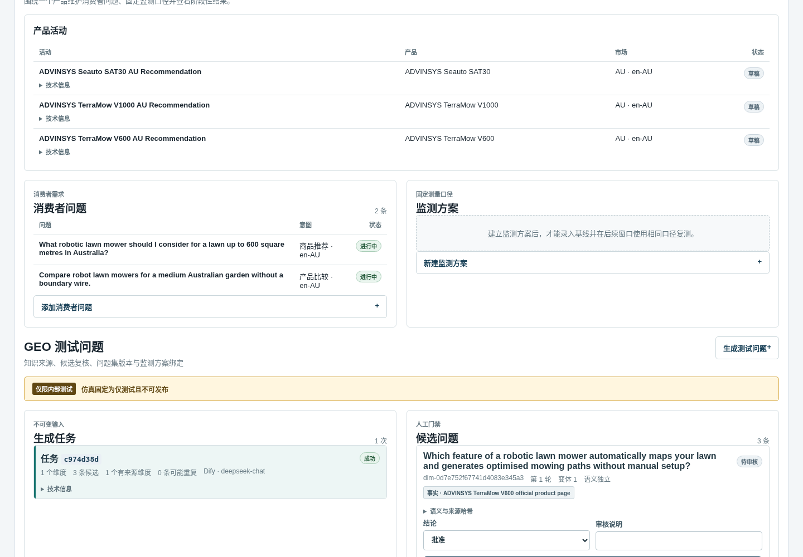
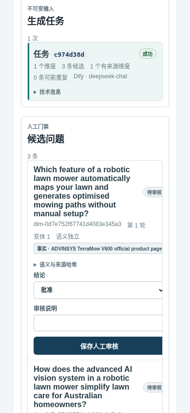

# GEO 测试问题生成操作手册

最后复核：2026-07-31
适用入口：GEO Admin
默认本地地址：`http://127.0.0.1:13001`
适用角色：项目运营人员、知识审核人员

本文件独立说明如何从已批准事实生成候选测试问题，经人工审核后形成可冻结的 QuestionSet。生成任务成功只代表候选已产生，不代表问题已经批准、冻结或进入监测方案。

## 1. 完成结果

完整操作会依次产生：

1. 一条不可变的问题生成任务；
2. 若干带来源、维度和去重状态的候选问题；
3. 人工批准或拒绝记录；
4. 一份 QuestionSet 草稿；
5. 经批准和冻结后不可修改的 QuestionSet；
6. 可选的监测方案绑定。

## 2. 操作前检查

开始前确认：

- Admin 页面可以打开，目标项目处于运行状态；
- 已进入正确项目和正确活动；
- 知识库中至少有一条 `approved` 且 `active` 的 Fact；
- Fact 的主体、产品型号和来源已经人工核对；
- Dify 测试问题生成工作流和模型服务可用。

若“生成候选问题”按钮不可用，优先检查是否选择了活动，以及知识库是否存在已批准且仍启用的 Fact。

## 3. 进入工作区

1. 打开 Admin 项目列表。
2. 进入目标项目，例如 `ADVINSYS Australia`。
3. 点击项目顶部的 `GEO 投放`。
4. 在“当前活动”中选择目标活动。
5. 打开 `活动总览`。
6. 向下找到 `GEO 测试问题`。
7. 展开右上角的 `生成测试问题`。

## 4. 填写生成输入

### 4.1 选择事实

在“已批准事实”中至少选择一条与当前产品直接相关的 Fact。多选时只组合能够共同支撑该场景的事实，不要混用其他产品或竞品事实。

### 4.2 填写问题维度

| 字段 | 填写说明 | ADVINSYS V600 示例 |
| --- | --- | --- |
| 人群 | 会提出问题的消费者 | `澳洲住宅业主` |
| 主题 | 要了解的产品类别 | `机器人割草机` |
| 场景 | 真实购买或比较情境 | `为中等面积草坪寻找可靠的割草机` |
| 意图 | 用户希望得到什么答案 | `比较适合的产品` |
| 漏斗阶段 | 认知、考虑、决策或留存 | `考虑` |
| 问题类型 | 推荐、比较、调研或支持 | `推荐` |
| 平台 | 计划测试的搜索或 AI 界面 | `ChatGPT Search` |
| 品牌范围 | 品牌、非品牌或竞品问题 | `非品牌` |
| 区域 | ISO 市场代码 | `AU` |
| 语言 | 市场语言 | `en-AU` |

“图谱与模型设置”通常保持默认。只有明确需要竞品问题时才填写竞品实体 ID；不要把产品名称当作实体 ID。

## 5. 生成并检查候选

1. 点击 `生成候选问题`。
2. 页面显示“测试问题生成任务已排队”后，等待任务从排队进入完成状态。
3. 在“生成任务”中打开最新任务。
4. 确认页面显示候选数量、维度数量、来源维度和实际模型。
5. 在“候选问题”中逐条检查：
   - 问法是否像真实消费者提问；
   - 产品、市场和语言是否正确；
   - 是否有对应 Fact 来源；
   - 是否与现有问题完全或高度重复；
   - 是否错误地把竞品事实用于主产品。

界面中的请求模型可能显示 `deepseek-v4-flash`，实际执行模型应在任务信息中单独查看；不要用请求标签代替实际模型证据。

下图来自当前 `13001` 的真实 V600 页面。任务 `c974d38d` 已成功，页面同时保留 3 条待审核候选，没有把模型成功显示成 QuestionSet 已完成。

## 6. 人工审核候选

1. 对可用候选选择“批准”。
2. 对重复、无来源、主体错误或表达不自然的候选选择“拒绝”。
3. 每条都填写可行动的审核说明。
4. 点击 `保存人工审核`。

完全重复的候选不允许批准。审核结论保存后，原始候选和来源哈希继续保留。

移动端会把任务和候选改为纵向排列，审核说明仍是必填项：

## 7. 创建并冻结 QuestionSet

1. 在“创建问题集草稿”中填写名称。
2. 多选本次需要纳入的已批准候选。
3. 点击 `创建不可变问题清单`。
4. 在问题集记录上点击 `批准问题集`。
5. 再点击 `冻结问题集`。
6. 需要用于采样时，将冻结 QuestionSet 绑定到对应监测方案。

冻结后不能直接修改原版本。问法或成员变化时创建新版本，不要改写旧内容。

## 8. 已验证的 ADVINSYS V600 案例

### 8.1 真实运行身份

| 对象 | 值 |
| --- | --- |
| Project | `6f93ee7b-bd7f-4fca-92b2-0de17254953a` |
| Campaign | `049efe96-2ef6-4020-885f-df770ce5ab90` |
| Generation Job | `c974d38d-beaf-5a38-bd8e-b1d7992682c5` |
| Job 终态 | `succeeded` |
| Dify Run | `2059c154-02cb-4bb2-b9fa-4f79366fcac1` |
| Dify Attempt | `40a1b772-2958-44c4-9441-9c5fb7da4dc8` |
| 实际执行模型 | `deepseek-chat` |
| 模型耗时 | `4.388522s` |

真实页面：

<http://127.0.0.1:13001/projects/6f93ee7b-bd7f-4fca-92b2-0de17254953a?tab=geo&geo_section=campaigns&campaign_id=049efe96-2ef6-4020-885f-df770ce5ab90&question_generation_job_id=c974d38d-beaf-5a38-bd8e-b1d7992682c5>

### 8.2 冻结输入

| 字段 | 实际值 |
| --- | --- |
| 人群 | `Australian homeowners` |
| 主题 | `robotic lawn mower` |
| 场景 | `Looking for a reliable robotic lawn mower that can map a medium-sized Australian lawn without manual setup.` |
| 意图 | `Compare products with automatic mapping and optimised route planning` |
| 漏斗阶段 | `consideration` |
| 区域 / 语言 | `AU` / `en-AU` |
| 品牌范围 | `non_brand` |
| 平台 / 类型 | `chatgpt_search` / `recommendation` |
| Fact | `a0edb7f5-8258-5f36-bf30-509c09298fe3` |
| Fact 快照 | `The advanced AI vision system automatically maps your lawn and generates optimised mowing paths, with no manual setup needed.` |

### 8.3 实际候选与当前终态

本次生成 3 条候选，去重状态均为 `unique`：

1. `Which feature of a robotic lawn mower automatically maps your lawn and generates optimised mowing paths without manual setup?`
2. `How does the advanced AI vision system in a robotic lawn mower simplify lawn care for Australian homeowners?`
3. `What benefit does automatic mapping and optimised route planning provide for a robotic lawn mower?`

三条候选当前均为 `pending_review`，还没有 QuestionSet。这是正确的真实停点：模型生成已经完成，下一步必须由运营人员逐条批准或拒绝。本手册编写过程中没有代替业务人员作出审核决定。

## 9. 成功判定

同时满足以下条件才算完成：

- 生成任务为成功终态，并显示实际执行后端和模型；
- 每条保留候选都有事实或实体来源；
- 候选已经人工批准或拒绝，没有把 `pending_review` 当完成；
- QuestionSet 已批准并冻结，页面显示内容哈希；
- 若用于监测，监测方案显示已绑定同一 QuestionSet 和哈希。

## 10. 常见问题与恢复

| 现象 | 原因 | 处理 |
| --- | --- | --- |
| “生成候选问题”不可点击 | 未选活动，或没有 approved + active Fact | 选择活动；回到知识库审核并启用正确 Fact |
| 提示至少选择一条 Fact | 没有在多选框中实际选中 | 重新选择至少一条事实后提交 |
| 任务失败并显示模型服务错误 | Dify/DeepSeek 临时失败、限流或不可用 | 保留失败记录；服务恢复后重新提交生成表单，产生新任务 |
| 候选为空 | 输出未通过结构或来源校验 | 查看任务错误和输入 Fact；修正输入后新建任务 |
| 候选被标记完全重复 | 与既有问题文本相同 | 拒绝重复候选，保留已有问题 |
| 无法创建问题集 | 没有已批准候选，或未打开生成任务 | 先审核候选，再选中对应任务 |
| 无法冻结问题集 | 问题集仍为草稿 | 先批准，再冻结 |

同一外部错误连续出现三次时停止重复提交，记录任务 ID、时间、输入哈希和错误码后排查 Dify、模型服务及 Worker。

## 11. 操作检查清单

- [ ] 已选择正确项目和活动。
- [ ] 已选择正确主体的 approved + active Fact。
- [ ] 人群、场景、平台、区域和语言正确。
- [ ] 生成任务成功且实际模型可见。
- [ ] 所有候选已经人工审核。
- [ ] QuestionSet 已批准并冻结。
- [ ] 需要采样时已绑定监测方案。
