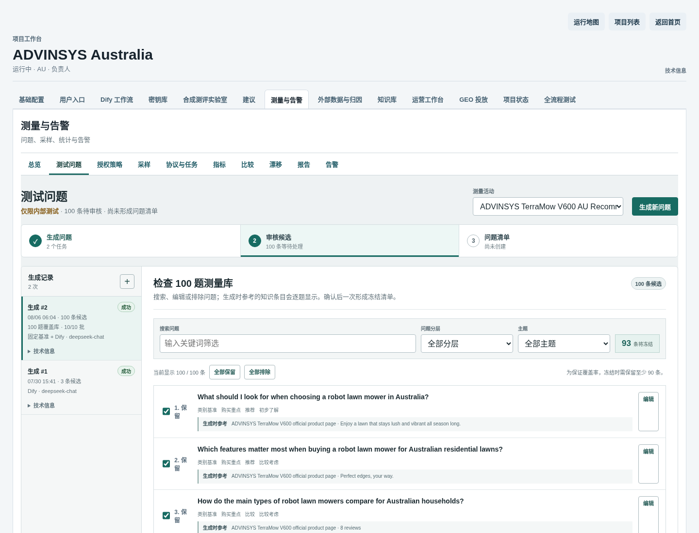
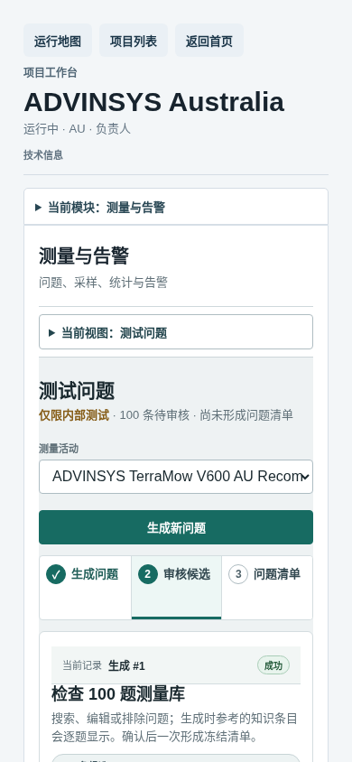

# GEO 测试问题生成操作手册

最后复核：2026-08-06

适用入口：GEO Admin

默认本地地址：`http://127.0.0.1:13001`

适用角色：项目运营人员、知识审核人员

本手册说明如何为一个产品活动一次生成完整的 100 个澳洲消费者测试问题，检查知识引用与疑似重复项，再由人工确认并冻结为 QuestionSet。生成成功只表示候选已产生，不代表问题已获业务确认、进入采样分母或形成客户结果。

## 1. 最终会得到什么

主流程会产生：

1. 一个 100 题生成任务，固定使用 `au-cross-engine-balanced-v1` 覆盖配置；
2. 50 条跨产品类别基准题、40 条产品适配题和 10 条品牌控制题；
3. 每题的角色、主题、漏斗位置、问题类型、去重结论和知识条目引用；
4. 10 个可独立恢复的生成批次，每批 10 题；
5. 人工保留、排除或编辑后的 90--100 题冻结 QuestionSet；
6. 可供后续监测方案绑定的不可变问题清单。

同一类别下不同产品的 50 条类别基准题保持一致，便于跨产品和跨引擎比较。产品适配与品牌控制题会读取当前 Campaign 的产品和已批准知识。

## 2. 操作前检查

开始前确认：

- Admin 页面可打开，项目处于运行状态；
- 已有目标产品的 Campaign，且 Campaign 关联当前主产品；
- 当前产品至少有一个来自官方 URL、已批准且仍有效的 Fact；
- Dify 的 `knowledge.question_generation` Release 已激活；
- Task Worker、PostgreSQL、Valkey 和 Dify 运行正常。

前端不要求操作员逐条选择 Fact。服务器会从 Campaign 当前产品和官方 URL 自动冻结可用 Fact。按钮不可用时，优先检查活动选择和已批准知识，而不是在页面中手工粘贴知识全文。

## 3. 打开测试问题页面

1. 打开 Admin 项目列表。
2. 进入目标项目，例如 `ADVINSYS Australia`。
3. 点击项目顶部的 `测量与告警`。
4. 打开 `测试问题`。
5. 在右上角选择目标活动，例如 `TerraMow V600`。
6. 确认页面显示 `生成问题 → 审核候选 → 问题清单` 三步。

`GEO 投放` 只读取已冻结 QuestionSet 的摘要。问题的生成、检查和冻结都在 `测量与告警 → 测试问题` 完成。

## 4. 一次生成完整 100 题

### 4.1 默认操作

1. 在 `生成问题` 页确认当前活动。
2. 查看 `澳洲跨引擎均衡配置`：类别基准 50、产品适配 40、品牌控制 10、主题 10。
3. 直接点击 `生成完整 100 题`。
4. 页面会显示最近任务和批次进度，并每 4 秒自动更新一次。
5. 任务达到 `10/10` 批、`100` 条候选和 `succeeded` 后，点击 `审核候选`。

每批包含 5 条确定性的类别基准题和 5 条由 Dify/DeepSeek 生成的产品相关题。只有模型输出通过结构、产品身份、知识引用和去重校验后，该批次才会写入不可变 checkpoint。

### 4.2 可选高级设置

通常不需要展开高级设置。确有业务重点时可填写：

| 字段 | 用途 | 建议 |
| --- | --- | --- |
| 补充要求 | 给 100 题增加本次关注点 | 不超过 120 字，例如 `额外关注斜坡、狭窄通道和可更换电池` |
| 语义重复阈值 | 标记含义过近的问题 | 保持默认 `0.92` |
| 模型调用预算 | 限制异常重试造成的调用量 | 保持默认 `60` |

补充要求是创意侧重点，不是系统指令，也不能替代知识库。不要粘贴 Prompt、Fact 全文或要求模型忽略校验。

## 5. 任务运行与恢复

运行记录会显示：

- 已完成批次，例如 `6/10`；
- 已保存候选，例如 `60/100`；
- 请求模型与实际执行模型；
- 失败原因和可恢复操作。

页面在前台时自动刷新；切到其他浏览器标签后暂停刷新。自动刷新达到上限时可点击 `刷新状态`。

如果任务进入 `failed` 或 `dead_lettered`：

1. 先阅读页面显示的失败代码；
2. 确认 Dify 或模型服务已恢复；
3. 点击 `从已保存批次继续`；
4. 确认批次从原 checkpoint 前进，而不是重新创建另一个 100 题任务。

恢复命令具有 Campaign 和任务身份校验；重复点击不会重复创建恢复请求。死信任务只会获得受总上限约束的一次人工尝试，不会无限重试。

## 6. 审核 100 个候选

任务成功后，审核页会一次显示完整候选集。可使用：

- `搜索问题`：按文字关键词定位；
- `问题分层`：只看类别基准、产品适配或品牌控制；
- `主题`：只看购买重点、场地适配、安装设置、表现、导航、安全、维护、可靠性、成本或本地服务；
- `编辑`：修正单题文字，原版本仍保留在修订记录中；
- 每题左侧复选框：保留或排除；
- `全部保留` / `全部排除`：快速重置当前选择。

每题下方的 `生成时参考` 会显式列出实际冻结的知识条目。检查时重点确认：

1. 澳洲消费者问法自然，语言为 `en-AU`；
2. 类别基准和产品适配题没有泄露品牌或型号；
3. 品牌控制题使用正确产品身份；
4. 知识引用属于当前产品和本次冻结 Fact；
5. 问题之间没有明显同义重复；
6. 问题适合作为跨搜索引擎重复采样输入，而不是产品宣传文案。

语义疑似重复项会标为 `疑似重复，需排除`，默认不纳入冻结选择。它们仍保留在候选记录中，供运营人员判断，不会被系统静默删除。

真实 V600 桌面审核页如下。100 条候选已经产生，7 条疑似重复默认排除，所以页面初始显示 93 条将冻结：

移动端改为单列列表，搜索、筛选、知识引用和保留开关仍然可用：

## 7. 确认并冻结 QuestionSet

1. 保留数量调整到 90--100 条。
2. 确认页面底部显示 `准备冻结 N 条问题`。
3. 点击 `确认并冻结 N 条`。
4. 页面跳转到 `问题清单`，确认新 QuestionSet 已冻结并带内容 hash。
5. 需要开始采样时，再将该 QuestionSet 绑定到草稿监测方案。

这个动作会一次完成候选确认和不可变 QuestionSet 创建，不需要逐题填写审核说明。冻结后不能原地改写；需要调整时创建新版本，避免改变已经进入实验或采样的分母。

## 8. 小范围单场景生成

`生成问题` 页下方仍保留单场景生成入口，只用于以下情况：

- 调试 Dify 输出或一个特定 Fact；
- 临时验证一种问法；
- 在创建完整题库前小范围检查新产品知识。

该入口需要手工选择 Fact，并填写人群、主题、场景、意图、漏斗、问题类型、平台、品牌范围、市场和语言。它通常只生成少量候选，不能替代 100 题覆盖库，也不应与完整覆盖任务混在同一个统计分母中。

日常运营优先使用 `生成完整 100 题`，不要为构建正式测量题库逐个提交单场景表单。

## 9. 已验证的 ADVINSYS 真实案例

三条任务都使用真实 Campaign、批准 Fact、Dify 和 DeepSeek，不是 fixture 或 mock：

| 产品 | Campaign | Generation Job | 候选 | 角色配额 | 疑似重复 | 越界 Fact |
| --- | --- | --- | ---: | --- | ---: | ---: |
| TerraMow V600 | `049efe96-2ef6-4020-885f-df770ce5ab90` | `0b4f68e1-03ad-5b48-a7e7-71d207bba1ad` | 100 | 50/40/10 | 7 | 0 |
| TerraMow V1000 | `877a6a9d-0a84-468c-b10a-ba85e2baffbb` | `4d528cc7-b703-559c-994a-8edf9a2a9b49` | 100 | 50/40/10 | 4 | 0 |
| TerraMow SAT30 | `92b215a8-f1eb-434d-9de8-afcf5a769639` | `b41101f3-0d48-5757-a5de-b824ec5d54a2` | 100 | 50/40/10 | 2 | 0 |

三条任务的实际生成后端均为 Dify，实际模型均为 `deepseek-chat`。V600 与 V1000 共享恰好 50 条类别基准题。V600 曾分别停在 `2/10` 和 `6/10` checkpoint，使用专用恢复操作后从已保存批次继续并完成 `10/10`，证明恢复不会重跑整套任务。

V600 真实审核页：

<http://127.0.0.1:13001/projects/6f93ee7b-bd7f-4fca-92b2-0de17254953a?tab=measurement&workflow_view=questions&campaign_id=049efe96-2ef6-4020-885f-df770ce5ab90&question_generation_job_id=0b4f68e1-03ad-5b48-a7e7-71d207bba1ad&question_step=review>

当前真实业务状态是 300 条候选均为 `pending_review`，尚未由本批次冻结任何 QuestionSet，也尚未进入采样。这个停点是有意保留的人工业务确认边界。

## 10. 成功判定

一次完整操作必须同时满足：

- 任务达到 `succeeded`、`10/10` 批和 100 条候选；
- 页面显示实际执行后端和模型，而不是只显示请求标签；
- 100 条问题文字不同，角色配额为 50/40/10；
- 每条产品相关题引用本次冻结的合法 Fact；
- 疑似重复项被人工排除或编辑后重新判断；
- 最终保留 90--100 条并创建冻结 QuestionSet；
- 只有绑定监测方案后，QuestionSet 才进入后续采样输入。

生成任务成功但候选仍为 `pending_review` 时，只能称为技术生成完成，不能称为业务题库完成。

## 11. 常见问题

| 现象 | 原因 | 可执行处理 |
| --- | --- | --- |
| `生成完整 100 题`不可点击 | 未选择 Campaign，或当前产品没有已批准 Fact | 选择活动；回知识库确认官方来源 Fact 已批准并有效 |
| 进度长时间不变化 | Worker、Dify 或模型服务异常，或页面自动刷新暂停 | 点击刷新；检查失败代码和服务状态，不要连续新建任务 |
| 任务在部分批次失败 | 模型输出格式、限流或服务错误 | 修复外部原因后点击 `从已保存批次继续` |
| 某题显示未知知识条目 | Fact 已失效、越界或展示投影不完整 | 不冻结；核对任务冻结 Fact 和当前知识投影 |
| 默认不足 90 条 | 疑似重复或拒绝项过多 | 编辑重复题或重新生成新的覆盖任务，不要强行纳入重复题 |
| 无法冻结 | 保留数不在 90--100，或任务未成功 | 调整保留项；等待任务完成 |
| 冻结后发现问题 | QuestionSet 不可变 | 创建新版本，不修改已冻结版本 |

同一外部错误连续出现三次时停止操作，保留 Project、Campaign、Job ID、失败代码和 checkpoint 数，再排查 Worker、Dify、模型及网络。

## 12. 操作检查清单

- [ ] 已选择正确项目、Campaign 和产品。
- [ ] 当前产品有官方来源、已批准且有效的 Fact。
- [ ] 已使用 `生成完整 100 题` 主入口。
- [ ] 任务达到 10/10 批、100 条候选和成功终态。
- [ ] 已确认实际 Dify Release 和实际模型。
- [ ] 已检查 50/40/10 配额、主题覆盖和知识引用。
- [ ] 已处理所有疑似重复和不自然问法。
- [ ] 最终保留数量为 90--100。
- [ ] QuestionSet 已由业务人员确认并冻结。
- [ ] 需要采样时已绑定监测方案。
