# GEO 全流程操作手册

> 历史文档：不再作为操作真源。部署、知识治理、内容生产、投放、客户交付和异常恢复统一使用 [ADVINSYS GEO 独立全流程操作手册](geo-ui-operator-guide.md)。

## 一、开始前先建立运行记录

每次验收先创建唯一 `RUN_ID`，例如 `20260715-advinsys-v600-01`，并记录：

| 项目 | 必填内容 |
| --- | --- |
| 代码 | commit SHA、分支、工作区是否干净 |
| 环境 | development/production、实际四个入口、Compose project |
| 数据 | tenant/project/campaign ID、是否空库初始化 |
| 人员 | Operator、Reviewer、Publisher、Customer Viewer 身份 |
| 外部服务 | DeepSeek configured/reported model、受控验证站点 |
| 证据目录 | `docs/operations/evidence/<RUN_ID>/` 或受控外部证据库 |

不要在运行记录、截图或终端转储中保存 Authorization、Cookie、邀请 token、DeepSeek Key、内部受限 Evidence 或完整模型敏感输入。

本次交付验收使用 `RUN_ID=final-live-deepseek-20260715`，运行代码基线为 `6f6eb5f`。截图由运行中的 Git、Compose、PostgreSQL 和验收 JSON 实时生成，不包含 Secret。

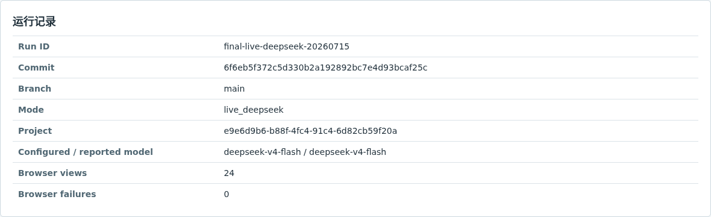

## 二、准备环境并启动完整栈

### 2.1 安装与 Secret

需要 Docker Compose、uv、Node.js 22 和 Corepack。从仓库根目录执行：

```bash
make install
cp -n .env.example .env
test -s deepseek_api_key.txt
chmod 600 deepseek_api_key.txt
stat -c '%a %n' deepseek_api_key.txt
```

开发环境默认宿主机入口：

- Admin Web：`http://localhost:3001`
- Customer Web：`http://localhost:3000`
- Internal API：`http://localhost:8000`
- Customer API：`http://localhost:8001`

如果端口冲突，只在 `.env` 覆盖四个 `GEO_*_HOST_PORT`，并把实际地址写入运行记录。DeepSeek Key 不写入 `.env`；`make dev-up` 将只读文件只挂载给 Worker，并自动使用当前宿主 UID/GID 运行开发 Worker，因此 key 继续保持 0600。不要为了容器读取而改成 0644。

### 2.2 启动与健康检查

```bash
make dev-up
docker compose -f infra/docker-compose.yml --profile workers ps
curl -fsS http://localhost:8000/health
curl -fsS http://localhost:8001/health
```

确认 `migrate` 成功退出，`postgres`、`minio`、`valkey` 健康，`internal-api`、`customer-api`、`task-worker`、`outbox-relay` 和双 Web 正在运行。

验证客户面没有内部路由：

```bash
test "$(curl -sS -o /dev/null -w '%{http_code}' \
  http://localhost:8001/v1/engineering/status)" = 404
test "$(curl -sS -o /dev/null -w '%{http_code}' \
  http://localhost:8001/v1/jobs)" = 404
```

成功标准：双健康检查返回服务名/状态；Customer API 对内部工程和 Job 路由返回 404，而不是 401/403。

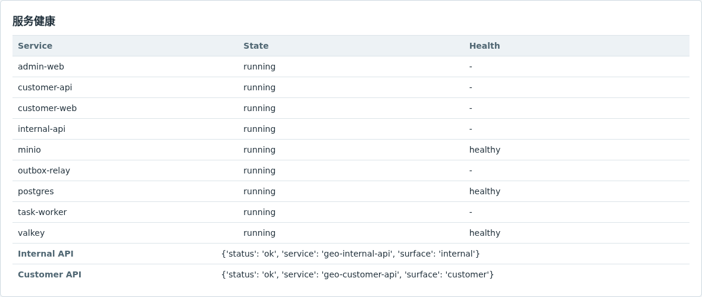

## 三、初始化首个 Owner 与登录

### 3.1 生产首个 Owner

生产必须先在 IdP 创建/确认管理员，再填写 `infra/production.env` 的 `GEO_BOOTSTRAP_*`。OIDC issuer、subject、tenant claim 必须与实际 token 完全一致，然后执行一次性服务：

```bash
make production-provision-owner PROD_ENV=infra/production.env
```

记录返回的 tenant、identity、project ID 和 `replayed`，不要记录 token。相同输入可安全重放；部分字段冲突时必须 fail closed。随后访问 Admin Web，点击“使用组织账号登录”。

### 3.2 本地开发身份

标准 development Compose 会幂等创建 `GEO Development Project` 和本地 Owner，Admin BFF 只在 development 模式自动发送这组固定身份头。执行 `make dev-up` 后直接访问 `http://localhost:3001/projects`，应看到该项目；不需要伪造 Cookie、手填 UUID 或开启 Dev Tools。

只有需要为自动化额外创建隔离项目时，才临时设置 `GEO_DEV_TOOLS_ENABLED=1` 并重启 Internal API，然后调用 Catalog Bootstrap。Dev Tools 默认关闭，不能用于客户演示或生产。

```bash
curl -sS -X POST http://localhost:8000/v1/dev-tools/catalog-bootstrap \
  -H 'Content-Type: application/json' \
  -d '{
    "tenant_name":"Acceptance Tenant",
    "identity_subject":"acceptance-owner",
    "identity_email":"owner@example.test",
    "project_name":"Acceptance Project"
  }'
```

只有显式 `GEO_DEV_TOOLS_ENABLED=1` 且环境不是 production 时该路由才存在。生产人工 UI 验收使用组织 OIDC，不为绕过登录而开启生产 Dev Tools。

成功标准：`/v1/auth/me` 返回可信身份及完整项目 membership；Admin 项目列表只显示获授权项目。

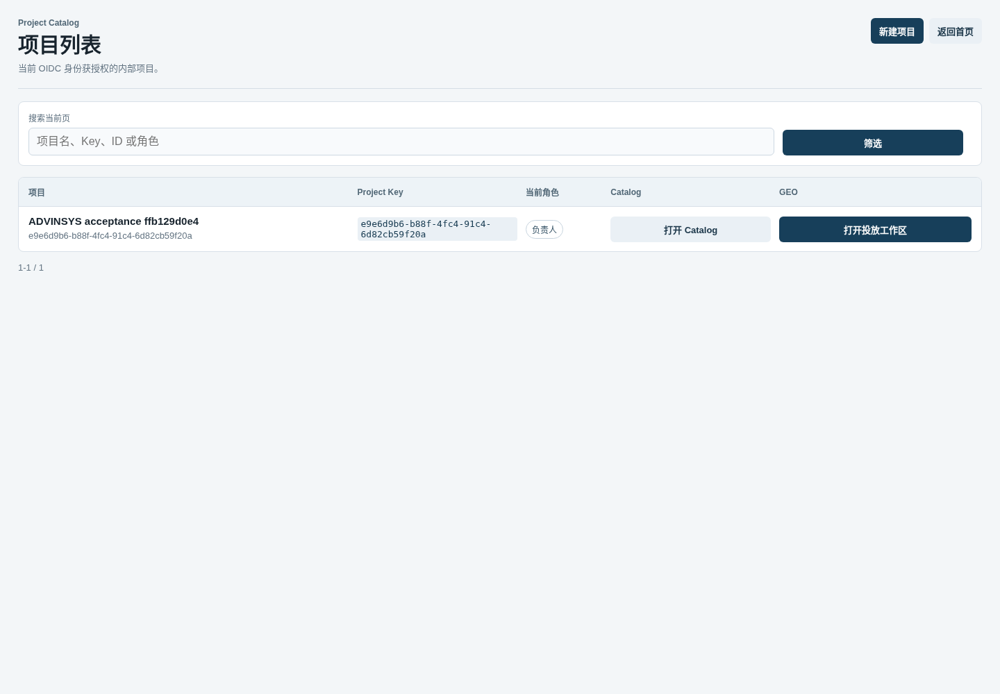

## 四、建立项目 Catalog、市场和人员

### 4.1 创建或打开项目

在 Admin 首页选择“新建 GEO 项目”，只填写项目名称并创建。打开项目 Catalog 后设置项目状态，保存：

- 品牌 Entity：`entity_type=brand`；
- 主商品 Entity：`entity_type=product`，填写官方产品 URL；
- 需要比较时再建立 competitor Entity；
- Market Profile：两位市场码、locale、timezone 和市场规则。

以澳大利亚为例可使用 `market_code=AU`、`locale=en-AU`、`timezone=Australia/Sydney`。一个不同商品建立一个独立 Campaign，不把多个产品的事实混入同一主商品。

对应稳定 API：

```text
POST /v1/projects
POST /v1/projects/{project_id}/entities
POST /v1/projects/{project_id}/market-profiles
```

成功标准：品牌、商品和市场均属于同一 `project_id`；商品有可核对的官方 URL。

### 4.2 内部成员与客户邀请

项目 Owner/Admin 在 Catalog 的成员区绑定已存在的 OIDC 身份。内部角色只有 `owner/admin/analyst`；不要创建共享审核账号。至少准备两个不同内部身份：提交人和 Reviewer。

在“客户邀请”区创建 `target_surface=customer` 的一次性邀请，把 invitation ID 和 token 通过受控渠道分别交付。邀请 token 只显示一次，不放入 URL；错误入口不会消费 token。

成功标准：最后一个 Owner 不能被撤销/降级；客户邀请只能在 Customer Web 兑换；已有多项目成员兑换新邀请后仍保留其他项目。

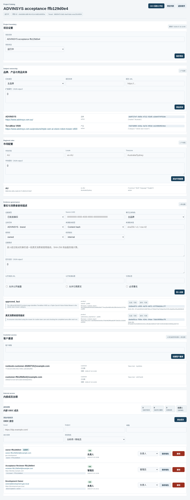

## 五、录入可生成 Evidence

在项目 Catalog 的 Evidence 区逐项添加已批准事实、公开引用或真实消费者描述。短文本可用 PostgreSQL text snapshot；长文或文件先存 MinIO，再保存 `s3://` URI 和 SHA-256。

每项至少核对：

1. `item_type`：`approved_fact`、`chunk`、`citation`、`report_extract`、`source_asset` 或 `consumer_experience`；
2. `subject_entity_id` 与 `subject_role`；
3. 原始 snapshot 和 64 位 SHA-256；
4. `source_revision`；
5. `usage_rights` 与 `confidentiality`；
6. 公开披露、URL、标题、引用/署名权限。

一段真实消费者使用描述只需保存描述、来源、授权和披露，不需要复杂体验者档案。它不能支持未出现的规格、排名或效果，也不能改写为未披露的独立评价。

成功标准：用于公开文案的 Evidence 显示 `eligible_for_generation=true`；需要公开引用的项还必须 `eligible_for_publication=true`。`unknown`、`restricted` 或不明主体不得通过。

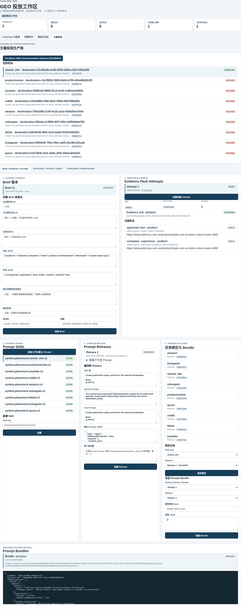

## 六、创建 Campaign 与冻结监测协议

Admin 项目页进入 `GEO 投放` 后，页面顶部的 Campaign 选择器决定当前上下文。四个一级入口分别是 `Campaign 总览`、`AI 观察`、`渠道计划` 和 `内容生产`。普通操作不需要复制项目、Campaign 或 Opportunity ID；排障时才展开“技术信息”。

### 6.1 先创建九个 Destination

进入 `GEO 投放 → 渠道计划`，展开“新增渠道任务”，为下列九个渠道各建一条具体目的地：

```text
owned_site, amazon, youtube, tiktok, instagram,
productreview, reddit, ozbargain, quora
```

每条填写：`destination_key`、具体页面/账号 URL、`destination_account_id`（有则填）和 `operation_mode=manual`。不要只填平台首页；Reddit 应具体到 subreddit/官方身份，YouTube/社媒应具体到授权账号，Amazon 应具体到卖家/商品目标。

在渠道表选择具体目标后，Owner/Admin 展开“复核或更新渠道政策”，新建不可变 Policy Review：

- `approved`：当前身份、内容类型和披露满足要求；
- `restricted`：可以继续，但创建投放请求时必须显式确认限制及依据；
- `prohibited`：当前品牌任务禁止，后续 Opportunity 保持阻断。

保存规则、身份要求、披露要求和 `allowed_hosts`。政策变化时创建新版本，不覆盖旧复核。

### 6.2 创建 Campaign

进入 `Campaign 总览`，展开“新建 Campaign”，按名称选择 Market Profile、主商品和九个 Destination，目标使用 `recommendation_influence`，填写真实业务 rationale。创建后系统为九个 Destination 一次性创建九个持久 Opportunity。

成功标准：Opportunity 列表正好覆盖所选九渠道；不能生成的渠道仍显示任务和阻断原因，不可消失。

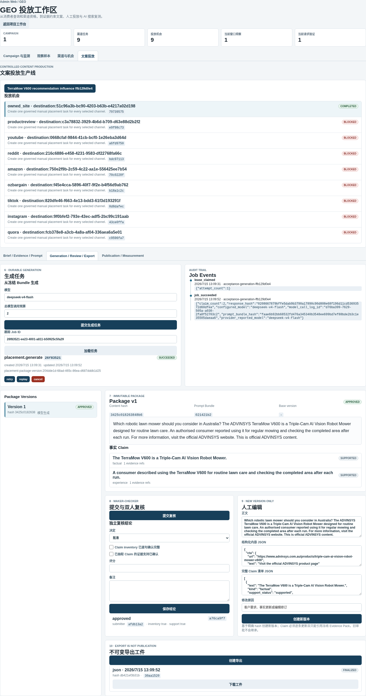

### 6.3 建立并冻结监测协议

在 `Campaign 总览` 的监测方案区创建 Monitoring Protocol，固定：平台、market profile、locale、设备、样本数和窗口天数。常见平台包括 `chatgpt_search`、`google_ai_overviews` 和 `google_search`。

逐条添加真实消费者 Query Suggestion，写明 `recommendation/comparison/research/support` 意图和 rationale。Owner/Admin 批准建议，使其成为 Monitoring Query；协议至少含一条批准 Query 后，先批准再冻结。

成功标准：Protocol 状态为 `frozen` 且有 `protocol_hash`；后续基线和复测都引用同一个 Protocol/Query。

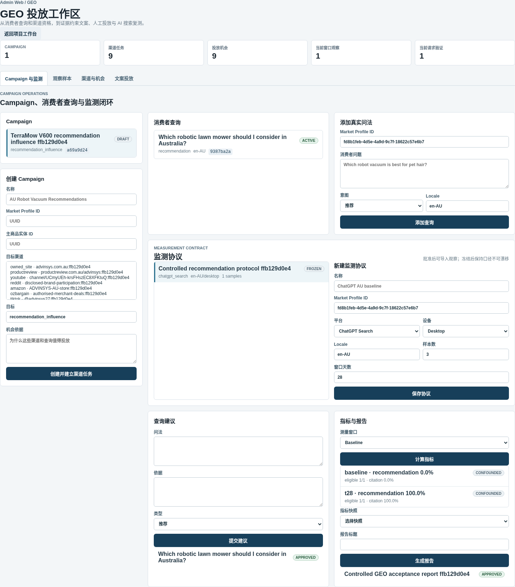

## 七、导入基线观察并计算指标

进入 `AI 观察`，展开“导入观察样本”，按冻结样本数逐个导入原始样本。每条必须填写：

- Monitoring Query、`measurement_window=baseline`、`sample_index`；
- 成功/失败、eligible 及不合格原因；
- 推荐、主商品提及、竞品提及布尔值；
- 原始回答或结构化结果；
- 每条 Citation URL 与验证状态；
- configured/reported model、UI surface、观察时间；
- 工件 URI/hash 和 confounding factors（存在时）。

每个写请求使用唯一 `Idempotency-Key`。网络超时后用相同 key 和相同 payload 重试；不要为同一样本生成另一个 key。

样本达到协议数量后计算 `baseline` Metric Snapshot。缺样本、失败、模型/UI 混杂时结果应为 `confounded`，不得手工改成 complete。

成功标准：原始样本可逐条查看；Metric 显示 expected/eligible sample count、推荐份额、商品提及、投放引用、覆盖和竞争差值。

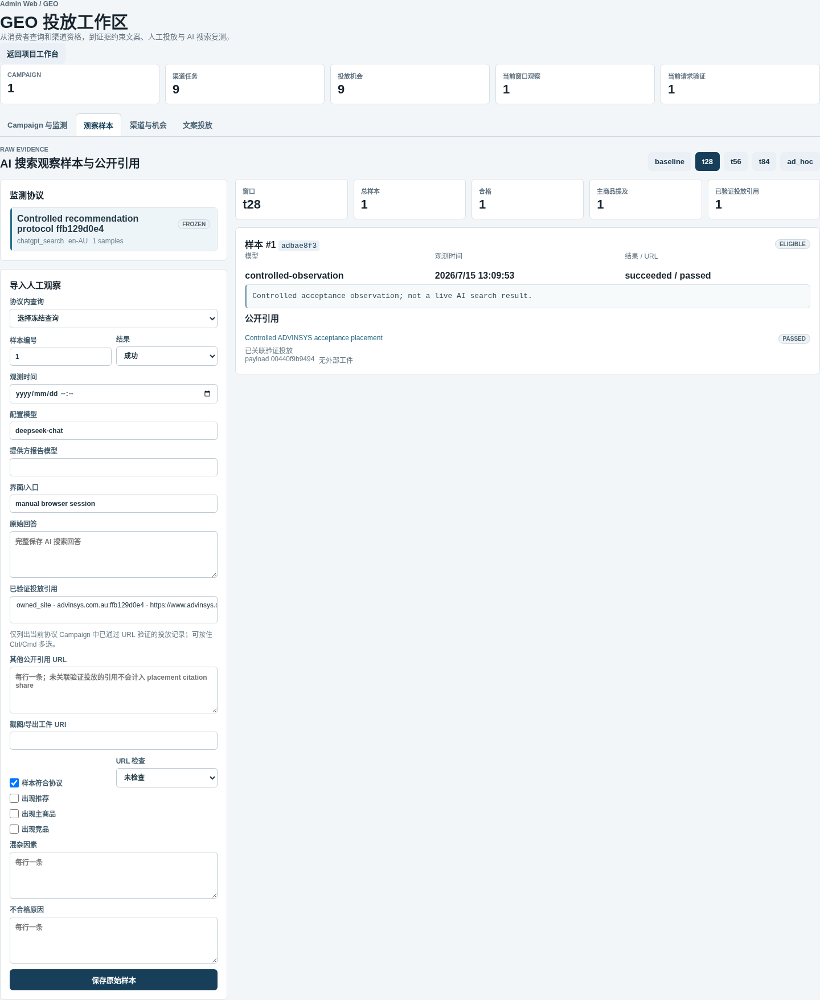

## 八、资格化 Opportunity 并建立 Brief

进入 `内容生产`。页面会显示当前渠道任务选择器和五步导航：`内容要求 → 证据与规则 → 生成文案 → 审核定稿 → 发布与测量`。每一步只展示当前决策所需字段；Prompt 版本和 Job 事件在高级区域中保留。

逐个检查 Opportunity 对应 Destination 的最新政策、账号身份和 Evidence：

- 条件满足：执行 `qualify`；
- 缺事实/授权：执行 `block` 并写可行动原因；
- 条件补齐：执行 `reopen` 后重新 `qualify`；
- 业务取消：执行 `cancel`。

在第一步“内容要求”为每个可生成 Opportunity 创建 Brief Version，按名称绑定主品牌 Entity，填写受众、内容目标、交付物、卖点、允许主体和比较主体。可选消费者体验只放真实原始描述、来源、授权和披露。任何 authenticity hard risk 都必须阻断，不得通过 accepted risk 放行。

成功标准：Brief 有版本号和 content hash；品牌、产品、竞品和市场主体没有串用。


## 九、构建 Evidence Pack Attempt

进入第二步“证据与规则”，在 Brief 下点击“构建证据”。Internal API 返回 `202`、Attempt 和 `job_id`；界面轮询 Job，Worker 异步挑选合格项目并固化 snapshot。

```text
POST /v1/projects/{project_id}/geo/brief-versions/{brief_version_id}/evidence-pack-attempts
GET  /v1/jobs/{job_id}
GET  /v1/projects/{project_id}/geo/evidence-pack-attempts/{attempt_id}/items
```

结果解释：

- `ready`：可创建 Prompt Bundle；
- `needs_evidence`：补充事实/来源后创建新 Attempt；
- `blocked`：先解除权限、保密、授权或政策阻断；
- `superseded`：已有后续成功 Attempt，历史只读。

旧 Attempt 不重置、不覆盖。任务失败时查看 Job Events，再选择 retry-now 或 replay；不要直接修改 Job 表。

成功标准：ready Attempt 有 `pack_hash`，每个 Item 有 subject、snapshot hash、rights 与公开 Citation 元数据。


## 十、选择或修改 Prompt

### 10.1 首次安装默认目录

在第二步“证据与规则”展开“高级：Prompt 规则与版本管理”，点击“同步九平台默认 Prompt”。该操作为每个 `task_key` 创建系统 Skill/Release 和项目 Binding；重复执行只补缺失绑定，不覆盖自定义选择。

### 10.2 单独修改提示词

需要调整某渠道时：

1. 新建 Prompt Skill；
2. 发布新的不可变 Release；
3. 变量只使用受支持的 `{{ brief }}`、`{{ destination_policy }}`、`{{ evidence }}` 或明确声明变量；
4. 输出 schema 必须要求 `content_json`、`rendered_text`、`claims`、`internal_evidence_refs`、`public_citation_refs`；
5. 将对应 `task_key` Binding 切到新 Release；
6. 用固定 Evidence Pack 生成测试并审核；异常时切回旧 Release。

修改 Prompt 不改 Campaign、Opportunity、Package 状态机或 Worker 代码。旧 Prompt Bundle 永久引用旧 Release，不被新选择污染。

### 10.3 创建 Prompt Bundle

在 ready Evidence Attempt 下选择该渠道绑定的 Release，填写变量和 64 位 `model_policy_hash`。创建后等待 Artifact 状态完成，再查看 manifest、bundle hash 和 MinIO URI。

成功标准：Bundle 路径基于 project/brief/bundle，不依赖还未生成的 Package；manifest 固定 Brief、Evidence、Release、变量、模型策略和输出 schema。


## 十一、用 DeepSeek 生成具体渠道文案

进入第三步“生成文案”，选择已冻结的生成输入并点击“开始生成”，模型保持 `deepseek-v4-flash`，总调用预算通常为 2。系统返回 Durable `generation` Job；刷新或等待状态由 queued/running 进入 succeeded/failed。

实时验收也可显式运行：

```bash
export GEO_DEEPSEEK_API_KEY_FILE="$PWD/deepseek_api_key.txt"
make deepseek-live
```

这会产生真实外部调用和费用，不进入普通 PR 测试。不要把本地模板、手填正文或历史 fixture 当作 DeepSeek 成功。

成功后核对 Package Version：

- 正文确实适配当前渠道，不是九渠道复制同一段；
- `content_json`、`rendered_text` 和 content hash 存在；
- 每个事实 Claim 有 Evidence Item IDs 与 support status；
- 内部 Evidence refs 与公开 Citation refs 分开；
- 披露符合 Destination Policy；
- Call Log 有 configured/reported model、token、finish reason 和 response hash。

生成 Job succeeded 只表示结果已持久化，不表示 Package 已批准或可以发布。

本次真实调用记录：configured/reported model 均为 `deepseek-v4-flash`，prompt/completion tokens 为 `1438/2258`，finish reason 为 `stop`，响应 hash 已持久化。实际批准文案为：

> Which robotic lawn mower should you consider in Australia? The ADVINSYS TerraMow V600 is a Triple-Cam AI Vision Robot Mower designed for routine lawn care. An authorised consumer reported using it for regular mowing and checking the completed area after each run. For more information, visit the official ADVINSYS website. This is official ADVINSYS content.


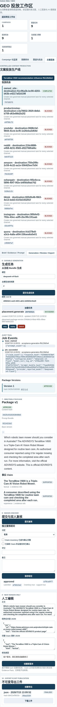

## 十二、人工编辑、Claim QA 与双人审核

### 12.1 修改内容

进入第四步“审核定稿”。需要改文案时，展开“人工修改并创建新版本”，编辑正文和逐条 Claim；界面会基于当前精确 Package Version 提交 `base_version_id`、`base_content_hash`、结构化内容、渲染正文和修改原因。不要直接覆盖旧正文。

成功标准：旧版本为 superseded，历史审核/导出/投放 lineage 保留；新版本重新进入 QA/审核。

### 12.2 提交和审核

Operator 点击“提交审核”。换用另一个内部身份打开同一 Package，逐项确认：

1. Claim inventory 没有漏掉事实句；
2. 每个 factual/comparative/experience Claim 有合格 Evidence；
3. 品牌、商品、竞品和市场主体正确；
4. 公开 Citation、授权、披露、CTA、链接和渠道格式正确；
5. 消费者描述没有被夸大或伪装成独立评价。

Reviewer 选择 approved/needs revision/rejected/blocked，填写两个独立布尔结论、0-100 分和 notes。批准要求不同身份、两个结论为 true、无 unsupported Claim 且分数至少 85。

成功标准：Package workflow status 为 `approved`；审核记录显示提交人、Reviewer、完整性结论和分数。


## 十三、导出与显式投放请求

### 13.1 导出

在 approved Package 上创建 Export，等待 Artifact finalize 后下载。导出包用于内部复核、客户确认或人工发布准备。

导出前后分别记录该 Package 的 Publication Request 数量。成功标准：数量完全不变；Export 只增加 Export Receipt/Artifact。

### 13.2 创建投放请求

进入第五步“发布与测量”。只有确认准备发布时，Owner/Admin 展开“标记为待发布”，选择 Destination 和 `publication_attempt`。restricted Policy 必须勾选确认并写 policy basis；prohibited Policy 不得放行。

这一步是系统内的明确 Publication Intent，但仍不会登录或操作第三方平台。重复点击使用同一 `Idempotency-Key` 恢复同一结果；合法的新尝试递增 `publication_attempt` 并使用新 key。

成功标准：Publication Request 保存 Package Version、Destination、channel、destination key、attempt、申请人和政策依据。


## 十四、人工发布、URL 回填与验证

### 14.1 外部人工动作

Publisher 下载 approved 包后离开 GEO 系统：

1. 登录已经授权的第三方账号；
2. 再次检查页面/社区最新政策；
3. 按 Package 的正文、披露、链接和提交说明操作；
4. 保存平台返回的 submission ID、时间和提交证据；
5. 不在 GEO 中保存第三方密码或 MFA 信息。

若渠道暂不满足条件，回到系统把 Publication/Submission 标记 blocked 或 cancel，并写原因。不得创建一个本地假 URL 冒充公开投放。

### 14.2 创建 Submission 和回填 URL

外部提交完成后，在 Publication Request 下创建 Submission。平台暂未给 URL 时可只填 provider submission ID；公开 URL 出现后执行一次 URL backfill。已回填 URL 不可随意覆盖。

### 14.3 异步在线验证

点击“验证在线”，系统返回 Verification Job。Worker 只访问 Destination allowlist 中的公网 Host，并检查可访问性、内容、披露和链接。查看 Job Events 与 Verification Result。

成功标准：

- 真实公开页面通过时 Submission 为 verified，Publication 为 published；
- 404、内容不匹配、披露缺失、错误 Host、内网地址或重定向逃逸必须失败；
- 失败结果不计入 Customer verified URLs 或 KPI；
- 验证成功后才创建 T+28/T+56/T+84 测量任务。

本次自动验收使用受控 URL Verifier 验证状态机、allowlist、lineage 和任务创建，没有冒充第三方真实发帖；客户项目的实际发布必须由 Publisher 按 14.1 执行。

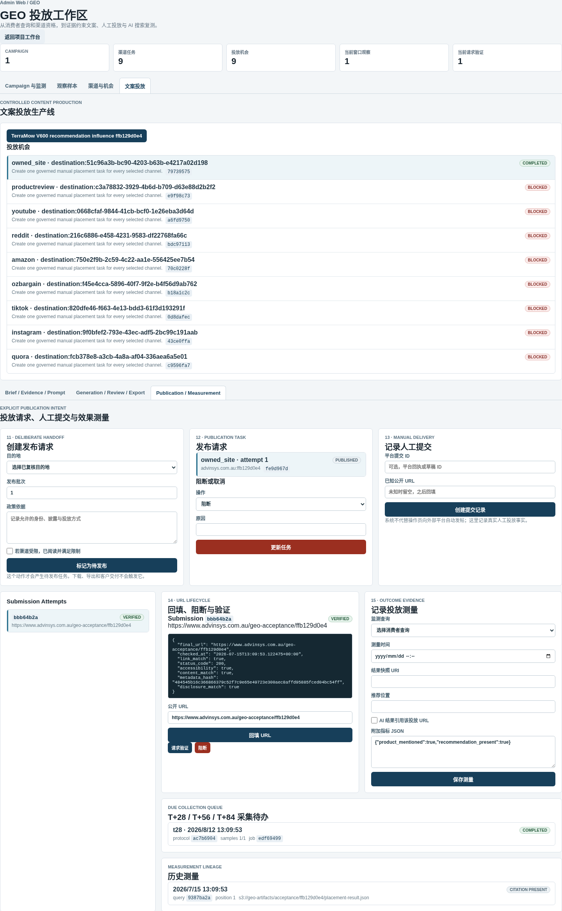

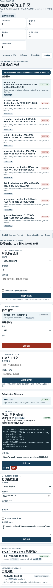

## 十五、复测、报告与客户交付

### 15.1 T+28/T+56/T+84 复测

到期后使用原冻结 Protocol/Query、相同 locale/设备/样本数导入对应窗口 Observation。保留原始回答、引用和工件；把模型/UI/库存/价格/季节/竞品变化写入 confounding factors。

每个窗口计算 Metric Snapshot。URL 已验证不代表 AI 一定引用；没有变化也必须如实保存。

### 15.2 生成并批准报告

在 Metrics 区选一个 Snapshot 生成报告，核对标题、正文、methodology statement、样本完整性、混杂因素和 report hash。Owner/Admin 批准后，报告才进入 Customer API。

### 15.3 客户兑换和查看

客户访问 `http://localhost:3000`，输入 invitation ID 和一次性 token。成功兑换后由 HttpOnly Cookie 维持 Session，URL 不保留 token。多项目客户用项目选择器切换。

客户门户应只显示：

- 项目 summary；
- 指标和测量窗口；
- 已验证公开 URL；
- 已批准报告。

未审核 Package、内部 Prompt、模型 Job、Evidence 原文、成员、Secret 和其他项目不得出现。单个只读资源失败时页面显示带 request ID 的局部错误，不把其他成功资源一起隐藏。

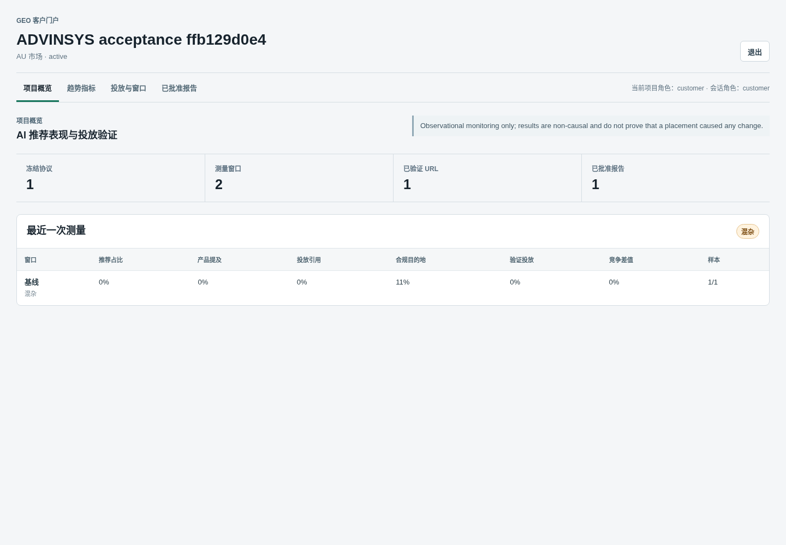

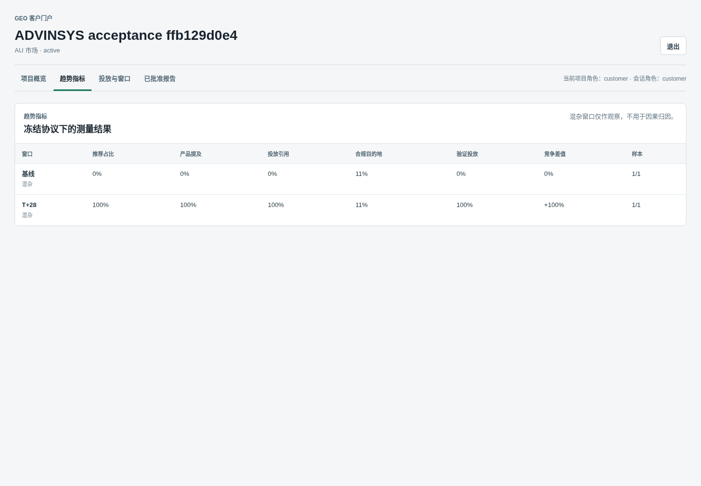

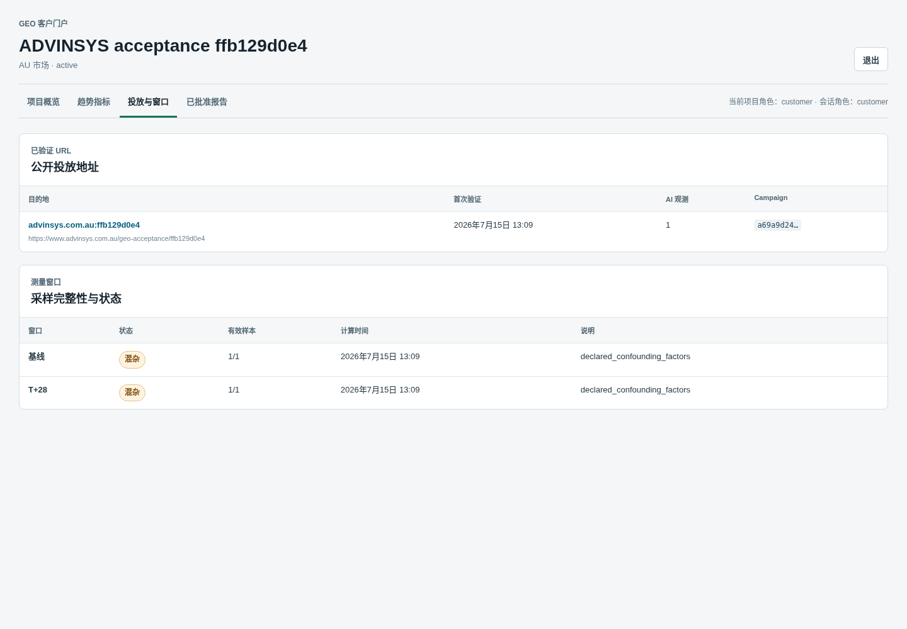

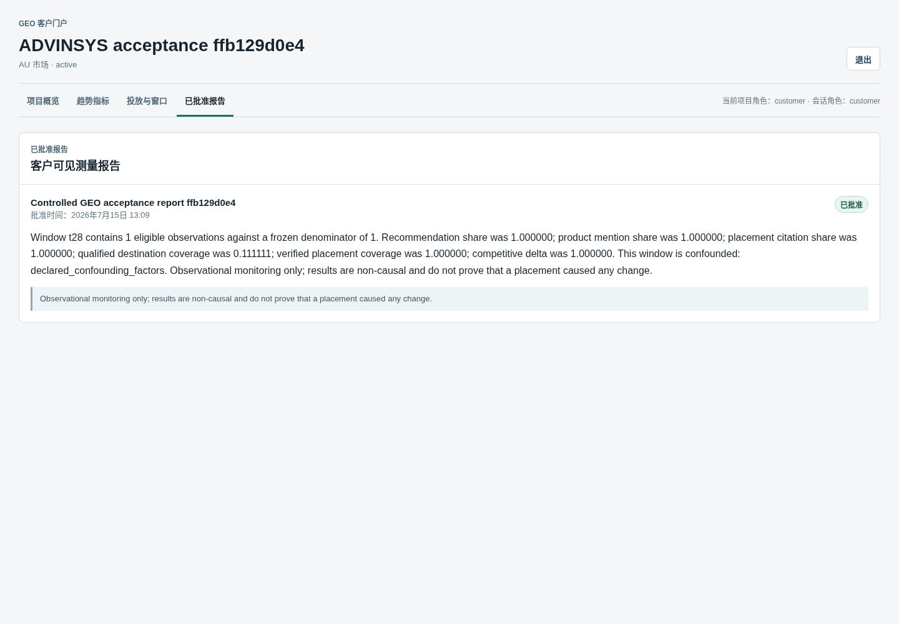

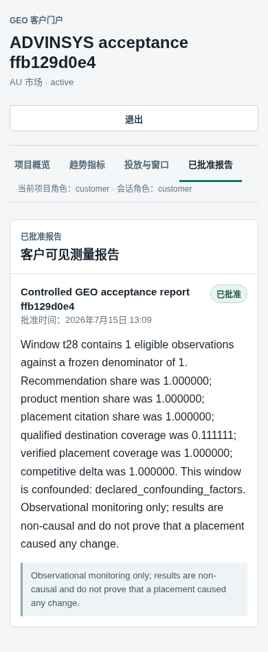

## 十六、Job 与常见故障处理

| 现象 | 检查 | 合规处理 |
| --- | --- | --- |
| Job 长时间 queued | Outbox Relay、Valkey、Worker 日志、Job Events | 修复唤醒后由 Relay 重投；业务真源仍在 PostgreSQL |
| Job running 后 Worker 重启 | `lease_expires_at`、fencing generation | 等待租约过期接管；不得手工伪造 succeeded |
| DeepSeek Key 缺失 | Worker Secret mount 与权限 | 修复只读 Secret 后 retry/replay；API 不应持有 Key |
| Evidence needs_evidence | Item rights、subject、public citation | 补充治理后创建新 Attempt |
| Evidence blocked | 权限、机密、政策、授权 | 解除阻断并保留旧 Attempt；不能 override 硬风险 |
| 生成 Schema 失败 | Prompt Release output schema、call budget | 新 Release 修复或 replay；不要编辑历史 Bundle |
| 同人审批失败 | 提交/Reviewer identity | 使用真实第二身份审核；禁止共享账号 |
| Export 后没有待发布记录 | 正常行为 | 需要发布时显式创建 Publication Request |
| URL 验证失败 | allowlist、HTTP、正文、披露、链接 | 修复外部页面后新建 retry；不要人工改状态 |
| Customer 403/空项目 | Invitation、membership、session expiry | Owner 核对项目授权，必要时新建邀请 |
| Customer 看见内部路由 | 严重隔离故障 | 停止交付，回滚并执行 OpenAPI/路由负向测试 |

排查日志：

```bash
make dev-logs
docker compose -f infra/docker-compose.yml --profile workers logs \
  --tail=300 task-worker outbox-relay internal-api customer-api
```

在共享 development 数据库运行 `pytest -m integration` 前，先执行 `docker compose -f infra/docker-compose.yml stop task-worker outbox-relay`，避免测试 outbox 被后台消费者抢占；测试结束后执行 `start` 恢复。CI 应使用隔离数据库，不与常驻 Worker 共享。

日志只应包含 request/job/project ID、状态和耗时等元数据。发现 Cookie、Authorization、Prompt 正文、模型完整响应或 Key 时立即按安全事件处理。

## 十七、备份与恢复

生产每日备份 PostgreSQL dump 和 MinIO 镜像，日备保留 7 份、周备保留 4 份。备份根目录必须在独立磁盘或远端挂载。

```bash
make backup PROD_ENV=infra/production.env
BACKUP_DIR=/srv/geo-backups/daily/<timestamp> \
  make restore-smoke PROD_ENV=infra/production.env
```

本地交付验收使用自动创建的唯一临时数据库和 bucket，不读取或修改常驻 development 业务
数据：

```bash
make backup-restore-dev-smoke
```

该命令动态解析当前 single Alembic head，以真实领域路径写入两个版本的 Secret canary/代表
secret、committed Provider raw/derived artifact、Synthetic independent-DEK 与 tier-key artifact，
以及 Recommendation 与 Workflow C 的 wrapped-DEK/object lineage，再生成只含密文、签名清单和
commit marker 的 bundle。恢复阶段比对 Project/表数量、全部 public 复合外键及四张核心关系的
确定性 SHA-256，分别对 `geo-artifacts` 与 `geo-restricted-workflow-c-artifacts` 逐对象比较
SHA-256，并对五份应用 keyring 执行正确 key、错误 key 和缺失 key 验证。source/restore
database、两个 bucket、tmpfs 明文和一次性 key 全部确认删除后才成功；`bundle/` 与 `receipt.json` 保存在
`artifacts/backup-restore-smoke-authenticated/<run-id>/`。

生产恢复冒烟在隔离且数据目录为 tmpfs 的 PostgreSQL 中执行，不写生产数据库；宿主解密区也
必须是由 `GEO_RESTORE_TMPFS_ROOT` 指定并经实际 filesystem type 检查的专用 tmpfs。核对认证
manifest、catalog、业务表 hash 和逐对象工件清单。至少每月执行一次，并把时间、备份 ID、
恢复耗时和结果写入运行证据。

成功标准：数据库计数、四表内容 hash 与 FK 全部一致，MinIO 每个对象 hash 一致，Secret Store
历史 key canary 可解密，恢复副本和 tmpfs 明文删除完成，且恢复环境不连生产第三方服务。

本次结果：PostgreSQL `4 -> 4` 个 Project、`74 -> 74` 张 public 表；MinIO `4 -> 4` 个对象且逐对象 SHA-256 一致。

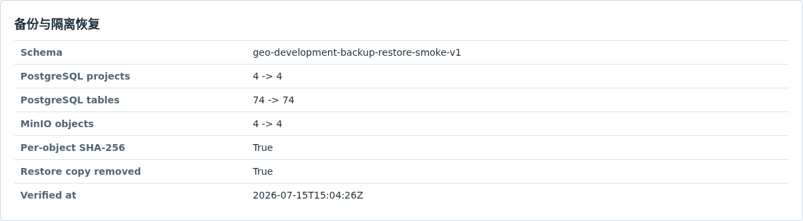

## 十八、最终交付清单

交付负责人逐项签字，不允许只凭一篇生成文案宣布完成：

- [ ] commit、运行 ID、环境、实际入口和服务健康证据完整；
- [ ] 首个 Owner、第二审核身份和客户 Invitation 闭合；
- [ ] 品牌、主商品、市场和可用 Evidence 有 ID/hash；
- [ ] Monitoring Protocol 已冻结，baseline 原始样本和指标可复现；
- [ ] 九渠道均有 Destination/Opportunity，阻断项原因真实可行动；
- [ ] ready Evidence Pack Attempt 与 Prompt Bundle lineage 完整；
- [ ] DeepSeek v4 flash 实际生成具体渠道正文和模型调用日志；
- [ ] Claim inventory、逐 Claim 支撑、不同身份审核和 >=85 分通过；
- [ ] 人工编辑不可变版本合同通过；
- [ ] Export 未产生 Publication Request；
- [ ] 显式 Publication Request 与人工第三方动作边界有证据；
- [ ] 至少一条真实公开 URL 成功/失败验证路径可复现；
- [ ] T+28/T+56/T+84 窗口和混杂说明完整；
- [ ] Customer 只读投影和多项目范围通过；
- [ ] 跨项目、同人审核、无证据、SSRF、重复消息、租约接管负向测试通过；
- [ ] 桌面、平板、移动截图与浏览器 console 证据归档；
- [ ] PostgreSQL + MinIO 备份及隔离恢复通过。

## 十九、真实截图登记表

下表登记 2026-07-15 主线实跑证据。Admin/Customer 页面使用真实 DeepSeek acceptance 数据；Playwright 共检查 24 个桌面/移动视图，console error、page error、5xx 和横向溢出均为 0。命令类图片由运行中的 Git、Compose、PostgreSQL 和 receipt 生成，未使用设计稿。

| 文件 | 页面/状态 | 视口 | Run ID | Commit | Console errors |
| --- | --- | --- | --- | --- | --- |
| `01-run-record.png` | 运行记录 | desktop | final-live-deepseek-20260715 | 6f6eb5f | N/A |
| `02-stack-health.png` | 服务健康 | desktop | final-live-deepseek-20260715 | 6f6eb5f | N/A |
| `03-admin-project-list.png` | Admin 项目列表 | desktop | final-live-deepseek-20260715 | 6f6eb5f | 0 |
| `04-catalog-members.png` | Catalog/成员 | desktop | final-live-deepseek-20260715 | 6f6eb5f | 0 |
| `05-evidence-governance.png` | Evidence | desktop | final-live-deepseek-20260715 | 6f6eb5f | 0 |
| `06-nine-channel-opportunities.png` | 九渠道任务 | desktop | final-live-deepseek-20260715 | 6f6eb5f | 0 |
| `07-frozen-protocol.png` | Monitoring | desktop | final-live-deepseek-20260715 | 6f6eb5f | 0 |
| `08-baseline-observations.png` | Observations | desktop | final-live-deepseek-20260715 | 6f6eb5f | 0 |
| `09-brief-version.png` | Brief | desktop | final-live-deepseek-20260715 | 6f6eb5f | 0 |
| `10-evidence-pack-job.png` | Evidence Job | desktop | final-live-deepseek-20260715 | 6f6eb5f | 0 |
| `11-prompt-release-bundle.png` | Prompt | desktop | final-live-deepseek-20260715 | 6f6eb5f | 0 |
| `12-deepseek-package.png` | Generation | desktop/mobile | final-live-deepseek-20260715 | 6f6eb5f | 0 |
| `13-maker-checker-review.png` | Review | desktop | final-live-deepseek-20260715 | 6f6eb5f | 0 |
| `14-export-publication-boundary.png` | Export/Request | desktop | final-live-deepseek-20260715 | 6f6eb5f | 0 |
| `15-submission-verification.png` | Verification | desktop/mobile | final-live-deepseek-20260715 | 6f6eb5f | 0 |
| `16-customer-*.png` | Customer 四视图 | desktop/mobile | final-live-deepseek-20260715 | 6f6eb5f | 0 |
| `17-backup-restore.png` | Backup/restore | desktop | final-live-deepseek-20260715 | 6f6eb5f | N/A |
| `21-new-project-current.png`、`21-project-list-current.png` | 新建项目与项目列表 | desktop | current-ui-20260717 | ff992dc + working tree | 0 |
| `22-project-basic-current.png`、`23-project-entry-current.png` | 基础配置与用户入口 | desktop | current-ui-20260717 | ff992dc + working tree | 0 |
| `24` 至 `29` `knowledge-*-current.png` | 知识导入、处理、Chunk、检索、看板、质检、追踪 | desktop | current-ui-20260717 | ff992dc + working tree | 0 |
| `30` 至 `33` `*-current.png` | Campaign、观察录入、渠道政策 | desktop | current-ui-20260717 | ff992dc + working tree | 0 |
| `34` 至 `40` `*-current.png` | 内容生产五步、Prompt 管理与 TEST ONLY | desktop | current-ui-20260717 | ff992dc + working tree | 0 |
| `41` 至 `43` `*-current.png` | 项目状态、全流程入口、客户登录 | desktop | current-ui-20260717 | ff992dc + working tree | 0 |
| `44-content-production-mobile-current.png` | 内容生产第一步 | 390x844 | current-ui-20260717 | ff992dc + working tree | 0 |

`current-ui-20260717` 截图在本次文档和界面变更尚未提交时采集，因此登记为 `ff992dc + working tree`。合并提交后应在下一次证据刷新中登记最终 commit；该说明不能被静默删除或改写为不存在的提交。
